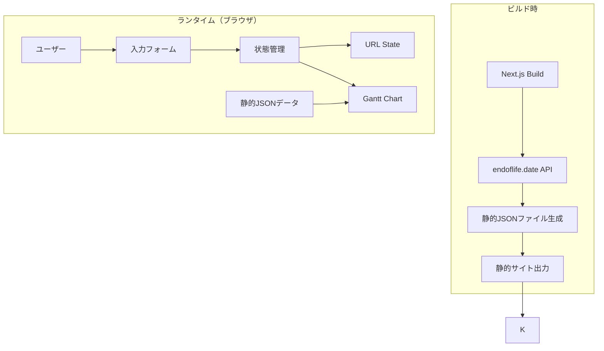

# 設計書

## 概要

EOL Timeline Viewerは、Next.jsで構築された静的Webアプリケーションで、複数のサービスで使用されている技術スタックのEnd of Life（EOL）情報をガントチャート形式で視覚化します。endoflife.date APIからビルド時にデータを取得し、@svar-ui/react-ganttライブラリを使用してインタラクティブなタイムラインを表示します。

### 主要機能

- **2カラムレイアウト**（左：入力フォーム、右：サービスリスト）
  - リアルタイム同期（フォーム入力が自動保存され、リストと常に同期）
  - 選択中サービスのハイライト表示
  - 技術プレビュー表示（最大3件）
  - 空状態時の案内メッセージ
- **サービス管理**
  - サービス名自動付与（service1, service2, service3...）
  - 新規サービス追加時に空の技術入力フォームを1つ自動表示
  - サービスの追加・削除・選択
- **インテリジェントサジェスト機能**
  - 技術名のオートコンプリート（キーボード操作対応：矢印キー、Enter、Escape）
  - 技術選択時のバージョン候補自動表示
  - バージョン入力時のリアルタイムフィルタリング
  - 外部クリックでサジェストを閉じる
- **EOLデータ取得**
  - endoflife.date APIからビルド時に全技術のデータを取得
  - すべてのフィールド（リリース日、サポート終了日、EOL日、LTS情報）を保持
- **ガントチャート表示**
  - サービスごとに独立したチャート
  - 現在バージョンから最新バージョンまでの全バージョンを表示（中間バージョンを含む）
  - ライフサイクルステージごとのセグメント分割と色分け
  - 現在使用中バージョンのマーカー表示（★）
  - バーの期間がリリース日とEOL日に正確に一致
- **URL共有機能**
  - セミコロン区切り形式でのエンコード/デコード
  - 自動URL更新
  - ラウンドトリップ保証
- **柔軟なエラーハンドリング**
  - 不完全なデータはスキップして可能な限り表示
  - 存在しない技術名はスキップ
  - エラー時もアプリケーションは継続動作
- **レスポンシブデザイン**

## アーキテクチャ

### 技術スタック

- **フレームワーク**: Next.js 14+ (App Router)
- **言語**: TypeScript
- **UIライブラリ**: React 18+
- **ガントチャート**: gantt-task-react
- **スタイリング**: Tailwind CSS
- **ビルド**: 静的エクスポート（next export）
- **データソース**: endoflife.date API
- **テスト**: Jest + React Testing Library

### アーキテクチャ図



### データフロー

1. **ビルド時**: endoflife.date APIから全製品のEOL情報を取得し、静的JSONファイルとして保存
2. **初期化時**: URLパラメータから状態を復元（存在する場合）
3. **入力時**: ユーザー入力を状態に反映し、URLを更新
4. **表示時**: 状態とEOLデータを結合してガントチャート用のデータ構造を生成

## コンポーネントとインターフェース

### コンポーネント構成

```
app/
├── page.tsx                    # メインページ
├── layout.tsx                  # ルートレイアウト
└── globals.css                 # グローバルスタイル

components/
├── ServiceForm.tsx             # サービス入力フォーム
├── TechnologyInput.tsx         # 技術スタック入力
├── EOLGanttChart.tsx           # ガントチャート表示
└── ErrorBoundary.tsx           # エラーハンドリング

lib/
├── eol-data.ts                 # EOLデータ取得・管理
├── url-state.ts                # URL状態管理
├── gantt-adapter.ts            # Ganttデータ変換
├── validation.ts               # バリデーション
└── types.ts                    # 型定義

scripts/
└── fetch-eol-data.ts           # ビルド時データ取得スクリプト

public/
└── data/
    └── eol-data.json           # 静的EOLデータ
```

### 主要コンポーネント

#### 1. ServiceForm

サービスと技術スタックの入力を管理するフォームコンポーネント。2カラムレイアウトで左側に入力フォーム、右側にサービスリストを表示。

**Props:**
```typescript
interface ServiceFormProps {
  services: Service[];
  onServicesChange: (services: Service[]) => void;
  availableTechnologies: string[];
  eolData: EOLDataMap;
}
```

**責務:**
- **2カラムレイアウトの実装**（左：入力フォーム、右：サービスリスト）
- **サービス管理**
  - サービスの追加・削除・選択
  - サービス名の自動付与（service1, service2, service3...の連番形式）
  - 新規サービス追加時に空の技術入力フォームを1つ自動表示
- **技術スタック管理**
  - 技術スタックの追加・削除
  - 各サービスに複数の技術を追加可能
- **リアルタイム同期**
  - フォーム入力が即座に状態に反映（自動保存）
  - 状態変更が即座にサービスリストに反映
  - デバウンスなしの即時反映
- **サービスリストの表示**
  - 選択中サービスのハイライト表示（青枠、青背景）
  - 各サービスに技術プレビュー表示（最大3件、それ以上は「+N」表示）
  - サービスクリックで編集対象を切り替え
  - 削除ボタンで個別削除
- **空状態の処理**
  - サービスが0件の場合、案内メッセージを表示
  - 「サービスを追加」ボタンへの誘導

#### 2. TechnologyInput

個別の技術スタック入力フィールド。インテリジェントサジェスト機能を含む。

**Props:**
```typescript
interface TechnologyInputProps {
  technology: Technology;
  availableTechnologies: string[];
  eolData: EOLDataMap | null;
  onChange: (technology: Technology) => void;
  onRemove: () => void;
}
```

**責務:**
- **技術名入力とサジェスト**
  - 技術名の入力フィールド
  - 利用可能な技術名リストからオートコンプリート
  - 入力内容に基づくリアルタイムフィルタリング
- **キーボード操作対応**
  - 矢印キー（↑↓）: 候補の選択移動
  - Enter: 選択中の候補を確定
  - Escape: サジェストを閉じる
- **バージョン入力とサジェスト**
  - 技術選択時に該当技術のバージョンリストを自動取得・表示
  - バージョン入力フィールド
  - 入力内容に基づくバージョン候補のフィルタリング
  - フォーカス時に全候補を表示
- **UI/UX機能**
  - 外部クリックでサジェストを閉じる
  - 削除ボタンで技術を削除
- **バリデーション**
  - バリデーションエラーの警告表示（入力は許可）
  - 視覚的フィードバック（赤枠、警告アイコン）
  - 柔軟な処理（過剰なバリデーションを避け、可能な限り入力を受け入れる）

#### 3. EOLGanttChart

ガントチャートを表示するコンポーネント。

**Props:**
```typescript
interface EOLGanttChartProps {
  services: Service[];
  eolData: EOLDataMap;
}
```

**責務:**
- **データ生成**
  - サービスデータとEOLデータの結合
  - gantt-task-react用のデータ構造への変換
- **チャート表示**
  - サービスごとに独立したガントチャートを表示
  - 現在バージョンから最新バージョンまでの全バージョンを個別の行として表示
  - 中間バージョンを含むすべてのバージョンを表示（バージョンの欠落がないこと）
- **ライフサイクル表示**
  - 各バージョンのバーをリリース日からEOL日までの期間として表示
  - バーの開始日と終了日が実際のリリース日とEOL日に正確に一致
  - ライフサイクルステージごとにセグメント分割
  - ステージごとの色分け表示（current: 緑、active: 青、maintenance: グレー、eol: 赤）
- **視覚的要素**
  - 現在使用中バージョンのマーカー表示（★）
  - 現在日付を示す垂直線の表示
  - ツールチップ表示（バージョン番号、リリース日、EOL日、ライフサイクルステージ）
  - ライフサイクルステージの凡例表示
- **レスポンシブ対応**
  - 画面サイズに応じた最適化

## データモデル

### 型定義

```typescript
// サービス定義
interface Service {
  id: string;
  name: string;
  technologies: Technology[];
}

// 技術スタック定義
interface Technology {
  id: string;
  name: string;           // 例: "python", "nodejs"
  currentVersion: string; // 例: "3.9"
}

// EOLデータ（endoflife.date APIから取得）
interface EOLCycle {
  cycle: string;          // バージョン番号
  releaseDate: string;    // リリース日（ISO 8601）
  eol: string | boolean;  // EOL日（ISO 8601）またはfalse
  support?: string;       // サポート終了日（オプション）
  lts?: boolean;          // LTSかどうか
}

interface EOLProduct {
  productName: string;
  cycles: EOLCycle[];
}

type EOLDataMap = Record<string, EOLProduct>;

// ガントチャート用データ構造（gantt-task-react用）
type LifecycleStage = 'current' | 'active' | 'maintenance' | 'eol';

interface GanttTask {
  id: string | number;
  text: string;           // 表示名
  start: Date;            // 開始日
  end: Date;              // 終了日
  type: "task" | "summary";
  parent?: string | number;
  progress?: number;
  css?: string;           // カスタムCSSクラス
  segments?: Array<{      // セグメント表示用
    start: Date;
    end: Date;
    stage: LifecycleStage;
  }>;
  details?: string;       // JSON文字列化された詳細情報
}

interface GanttScale {
  unit: "year" | "month" | "day";
  step: number;
  format: string;
}
```

### ライフサイクルステージの詳細

バージョンのライフサイクルステージは、endoflife.date APIから取得した実際の日付フィールド（`lts`、`support`、`eol`）に基づいて判定されます。

#### ステージ定義

| ステージ | 色 | カラーコード | 意味 |
|---------|-----|------------|------|
| **current** | 緑 | #22c55e | 最新・推奨バージョン（LTS開始前） |
| **active** | 青 | #3b82f6 | アクティブサポート中 |
| **maintenance** | グレー | #94a3b8 | メンテナンスモード（セキュリティ修正のみ） |
| **eol** | 赤 | #ef4444 | サポート終了済み |

#### 判定ロジック

endoflife.date APIのデータ構造に基づいて判定します。

**判定表:**

| パターン | ltsフィールド | supportフィールド | 期間1 | 期間2 | 期間3 | 具体例 |
|---------|-------------|-----------------|-------|-------|-------|--------|
| **1. LTS日付あり** | 文字列（日付） | あり | releaseDate → lts<br/>**current**（緑） | lts → support<br/>**active**（青） | support → eol<br/>**maintenance**（グレー） | Node.js LTS |
| **2. supportあり** | false | あり | releaseDate → support<br/>**active**（青） | support → eol<br/>**maintenance**（グレー） | - | Rails、Python、PHP、Node.js非LTS |
| **3. supportなし** | false | なし | releaseDate → eol<br/>**active**（青） | - | - | Ruby、PostgreSQL、Go |
| **4. EOL済み** | - | - | 全期間<br/>**eol**（赤） | - | - | 過去のバージョン |

**データ例:**

```json
// パターン1: Node.js 24 LTS
{
  "cycle": "24",
  "releaseDate": "2025-05-06",
  "lts": "2025-10-28",        // LTS開始日（文字列）
  "support": "2026-10-20",    // アクティブサポート終了日
  "eol": "2028-04-30"
}

// パターン2: Rails 8.1
{
  "cycle": "8.1",
  "releaseDate": "2025-10-22",
  "support": "2026-10-10",    // サポート終了日
  "eol": "2027-10-10",
  "lts": false
}

// パターン3: Ruby 4.0
{
  "cycle": "4.0",
  "releaseDate": "2025-12-25",
  "eol": "2029-03-31",
  "lts": false
}

// パターン4: Python 3.9（EOL済み）
{
  "cycle": "3.9",
  "releaseDate": "2020-10-05",
  "eol": "2025-10-31",        // 過去の日付
  "lts": false
}
```

**判定ルール:**
1. EOL日が現在より過去 → **eol**（全期間）
2. `lts`フィールドが文字列（日付）の場合 → パターン1
3. `support`フィールドがある場合 → パターン2
4. `support`フィールドがない場合 → パターン3

```typescript

### URL状態エンコーディング

URLパラメータは人間が読みやすいセミコロン区切り形式でエンコードされます：

```
?s=サービス名(技術:バージョン,技術:バージョン);サービス名(技術:バージョン)
```

**フォーマット仕様:**
- サービスは `;` (セミコロン) で区切る
- 各サービスは `サービス名(技術リスト)` の形式
- 技術リストは括弧 `()` で囲む
- 技術は `,` (カンマ) で区切る
- 各技術は `技術名:バージョン` の形式（`:` で区切る）

**具体例:**

```
# 単一サービス、複数技術
?s=myapp(python:3.9,nodejs:18.0)

# 複数サービス
?s=myapp(python:3.9,nodejs:18.0);api(go:1.20,postgres:15)

# 3つのサービス
?s=web(react:18,nodejs:20);api(python:3.11);db(postgres:15)
```

**エンコード処理:**
1. 各サービスを処理
2. 技術は `技術名:バージョン` 形式で `,` で結合
3. 技術リストを括弧 `()` で囲む
4. サービス名と技術リストを結合
5. サービスを `;` で結合
6. 特殊文字（`:`, `;`, `,`, `(`, `)`）をURLエンコード（`encodeURIComponent`）

**デコード処理:**
1. URLパラメータから取得（`decodeURIComponent`）
2. `;` でサービスに分割
3. 各サービスを `(` でサービス名と技術リストに分割
4. 技術リストから末尾の `)` を削除
5. 技術リストを `,` で分割
6. 各技術を `:` で技術名とバージョンに分割
7. 不完全なデータ（技術名やバージョンの欠落）はスキップして処理を継続
8. 有効なデータのみを返す

**エスケープ処理:**

サービス名、技術名、バージョンに特殊文字が含まれる場合は、`encodeURIComponent`でエスケープします：

```typescript
// エンコード例
const serviceName = "my-app [prod]";  // 括弧を含む
const encoded = encodeURIComponent(serviceName);
// → "my-app%20%5Bprod%5D"

// デコード例
const decoded = decodeURIComponent(encoded);
// → "my-app [prod]"
```

**メリット:**
1. URLエンコード不要な文字のみ使用（括弧と `:` はエンコード不要）
2. `@` より見やすく、関数呼び出しのような自然な構文
3. より短いURL
4. 手動編集が容易
5. URLから直接サービス名、技術名、バージョンが読み取れる

## 正確性プロパティ

*プロパティとは、システムのすべての有効な実行において真であるべき特性や振る舞いのことです。プロパティは、人間が読める仕様と機械で検証可能な正確性保証の橋渡しとなります。*

### プロパティ1: サービス名自動付与

*任意の*新規サービス追加時に、システムは自動的に service{N} 形式の連番名を付与する（例：service1, service2, service3）
**検証: 要件 1.2**

### プロパティ2: 複数技術の追加と保持

*任意の*サービスに対して、複数の技術を追加した場合、それらすべてが保持され、取得可能である
**検証: 要件 1.4, 7.6**

### プロパティ3: バージョンリスト自動表示

*任意の*技術名選択時に、その技術の利用可能なバージョンリストが自動的に表示される
**検証: 要件 1.6**

### プロパティ4: バージョン候補フィルタリング

*任意の*バージョン入力内容に対して、入力内容を含むバージョン候補のみがフィルタリングされて表示される
**検証: 要件 1.7**

### プロパティ5: URL自動更新

*任意の*データ変更に対して、URLパラメータが自動的に更新され、変更内容が反映される
**検証: 要件 1.9, 4.2**

### プロパティ6: リアルタイム同期

*任意の*フォーム入力変更に対して、その変更が即座にサービスリストに反映される（デバウンスなしの即時反映）
**検証: 要件 1.11**

### プロパティ7: 選択中サービスのハイライト

*任意の*サービス選択に対して、選択中のサービスがサービスリスト上でハイライト表示される
**検証: 要件 1.12**

### プロパティ8: 技術プレビュー表示制限

*任意の*サービスに対して、サービスリストに表示される技術プレビューは最大3件までであり、それ以上の技術がある場合は「+N」形式で表示される
**検証: 要件 1.13**

### プロパティ9: EOLデータフィールドの完全保持

*任意の*EOLデータに対して、リリース日、サポート終了日、EOL日、LTS情報などのすべてのフィールドが取得後も保持される（データ完全性の不変条件）
**検証: 要件 2.2, 2.5**

### プロパティ10: 全サービスと技術の表示

*任意の*サービスセットに対して、すべてのサービスとそれに含まれるすべての技術が、ガントチャート上に個別の行として表示される
**検証: 要件 3.1**

### プロパティ11: 全バージョンの表示

*任意の*技術とバージョン範囲に対して、現在のバージョンから最新バージョンまでのすべてのバージョンが表示される（中間バージョンを含む、バージョンの欠落がないこと）
**検証: 要件 3.2, 3.9**

### プロパティ12: バーの期間の正確性

*任意の*バージョンに対して、ガントチャートのバーの開始日はリリース日と正確に一致し、終了日はEOL日と正確に一致する
**検証: 要件 3.3, 3.10**

### プロパティ13: ライフサイクルステージの色分け

*任意の*バージョンに対して、そのライフサイクルステージ（current、active、maintenance、eol）に応じて異なる色が適用される
**検証: 要件 3.4**

### プロパティ14: セグメント表示の正確性

*任意の*バージョンに対して、ライフサイクルステージの期間ごとに正しい色でセグメント分割されて表示される
**検証: 要件 3.4**

### プロパティ15: 現在使用中バージョンのマーカー表示

*任意の*サービスと技術に対して、現在使用中のバージョンがガントチャート上でマーカー（★）により明示的に表示される
**検証: 要件 3.5**

### プロパティ16: URLエンコード形式

*任意の*サービスデータセットに対して、URLパラメータがセミコロン区切り形式（`サービス名(技術:バージョン,技術:バージョン);サービス名(技術:バージョン)`）で正しくエンコードされる
**検証: 要件 4.1**

### プロパティ17: 状態復元

*任意の*URL状態を含むURLに対して、アプリケーションの状態が正しく復元される
**検証: 要件 4.3**

### プロパティ18: 特殊文字のエスケープ

*任意の*特殊文字（`:`, `;`, `,`, `(`, `)`）を含むサービス名や技術名に対して、適切にエスケープされ、エンコード/デコードが正しく行われる
**検証: 要件 4.4**

### プロパティ19: URL状態のラウンドトリップ

*任意の*有効なサービスデータセットに対して、セミコロン区切り形式へのエンコードとデコードを行うと、元のデータと等価なデータが復元される（シリアライゼーションのラウンドトリッププロパティ）
**検証: 要件 4.6**

### プロパティ20: 不完全データのスキップ処理

*任意の*不完全なデータ（技術名やバージョンの欠落）を含むURLに対して、システムは不完全な部分をスキップし、有効なデータのみを表示する
**検証: 要件 7.1**

### プロパティ21: 存在しない技術名のスキップ

*任意の*存在しない技術名を含むデータに対して、システムはその技術をスキップし、他の有効な技術の表示を継続する（柔軟なエラーハンドリング）
**検証: 要件 7.2**

### プロパティ22: エラー時のアプリケーション継続

*任意の*エラー発生時に、システムはユーザーフレンドリーなエラーメッセージを表示し、アプリケーションがクラッシュせずに動作を継続する
**検証: 要件 7.3**

### プロパティ23: XSS攻撃の防止

*任意の*ユーザー入力に対して、適切にエスケープされ、XSS攻撃が防止される
**検証: 要件 7.4**

## エラーハンドリング

### エラーの種類と対応

#### 1. 入力バリデーションエラー

**発生条件:**
- 空の技術名
- 無効なバージョン形式

**対応:**
- フィールドレベルでのエラーメッセージ表示（警告として表示、入力は許可）
- エラー状態のクリア（修正時）
- 視覚的フィードバック（赤枠、警告アイコン）
- 柔軟な処理（過剰なバリデーションを避け、可能な限り入力を受け入れる）

#### 2. データ取得エラー（ビルド時）

**発生条件:**
- endoflife.date APIへの接続失敗
- APIレスポンスの形式エラー
- タイムアウト

**対応:**
- エラーログの出力
- リトライロジック（最大3回、1秒間隔）
- API制限を避けるための待機時間
- 成功率が低い場合の警告表示
- 個別の製品取得失敗時は空配列を返してスキップ

#### 3. URL状態デコードエラー

**発生条件:**
- 不正なフォーマット（区切り文字の誤り）
- 不正なエスケープシーケンス
- 不完全なデータ（技術名やバージョンの欠落）

**対応:**
- 不完全なデータはスキップして可能な限り表示を継続
- コンソールに警告メッセージを出力
- 完全に不正な場合のみエラーメッセージを表示し、空の状態で初期化
- エラーの詳細をコンソールに記録

#### 4. 存在しない技術名

**発生条件:**
- endoflife.dateに存在しない技術名を入力

**対応:**
- コンソールに警告メッセージを出力
- その技術をスキップ
- 他の技術の表示は継続
- ユーザーには空のチャートまたは部分的なチャートを表示

#### 5. URL長制限超過

**発生条件:**
- エンコード後のURLが2048文字を超える

**対応:**
- ユーザーに通知メッセージを表示
- データの追加を防止または警告
- 現在のURL長を表示

### エラーバウンダリ

React Error Boundaryを使用して、予期しないエラーをキャッチします。

```typescript
class ErrorBoundary extends React.Component {
  state = { hasError: false, error: null };
  
  static getDerivedStateFromError(error) {
    return { hasError: true, error };
  }
  
  componentDidCatch(error, errorInfo) {
    console.error('Error caught by boundary:', error, errorInfo);
  }
  
  render() {
    if (this.state.hasError) {
      return (
        <div className="min-h-screen flex items-center justify-center">
          <div className="text-center">
            <h2>エラーが発生しました</h2>
            <p>ページを再読み込みしてください</p>
            <button onClick={() => window.location.reload()}>
              再読み込み
            </button>
          </div>
        </div>
      );
    }
    return this.props.children;
  }
}
```

## テスト戦略

### デュアルテストアプローチ

このプロジェクトでは、単体テストとプロパティベーステストの両方を使用します：

- **単体テスト**: 特定の例、エッジケース、エラー条件を検証
- **プロパティテスト**: すべての入力にわたる普遍的なプロパティを検証

両方のアプローチは補完的であり、包括的なカバレッジに必要です。

### 単体テストのバランス

単体テストは特定の例とエッジケースに焦点を当てます：

- **特定の例**: 正しい動作を示す具体的なケース
- **統合ポイント**: コンポーネント間の連携
- **エッジケースとエラー条件**: 境界値や異常系

プロパティテストは以下に焦点を当てます：

- **普遍的なプロパティ**: すべての入力に対して成り立つ性質
- **包括的な入力カバレッジ**: ランダム化による広範なテスト

### プロパティベーステスト設定

**使用ライブラリ**: fast-check（TypeScript/JavaScript用）

**設定:**
- 各プロパティテストは最小100回の反復を実行
- 各テストは設計書のプロパティを参照
- タグ形式: **Feature: eol-timeline-viewer, Property {番号}: {プロパティテキスト}**

### テストカテゴリ

#### 1. サービス管理テスト

**単体テスト:**
- サービス追加/削除/選択の基本動作
- 空状態の案内メッセージ表示
- 新規サービス追加時の空フォーム自動表示

**プロパティテスト:**
- プロパティ1: サービス名自動付与
- プロパティ2: 複数技術の追加と保持
- プロパティ6: リアルタイム同期
- プロパティ7: 選択中サービスのハイライト
- プロパティ8: 技術プレビュー表示制限

#### 2. 技術入力とサジェストテスト

**単体テスト:**
- 技術追加/削除の基本動作
- キーボード操作（矢印キー、Enter、Escape）
- 外部クリックでサジェストを閉じる

**プロパティテスト:**
- プロパティ3: バージョンリスト自動表示
- プロパティ4: バージョン候補フィルタリング

#### 3. URL状態管理テスト

**単体テスト:**
- 空のデータセットのエンコード/デコード
- 単一サービスのエンコード/デコード
- 不正なURL文字列のデコードエラー
- URL長が2048文字を超える場合の通知

**プロパティテスト:**
- プロパティ5: URL自動更新
- プロパティ16: URLエンコード形式
- プロパティ17: 状態復元
- プロパティ18: 特殊文字のエスケープ
- プロパティ19: URL状態のラウンドトリップ

#### 4. ガントチャート表示テスト

**単体テスト:**
- 単一バージョンのGanttタスク変換
- 複数バージョンのGanttタスク変換
- EOL済みバージョンのスタイリング
- ライフサイクルステージの判定
- セグメント分割の正確性
- 現在日付の垂直線表示
- ホバー時の詳細情報表示
- ライフサイクルステージの凡例表示

**プロパティテスト:**
- プロパティ10: 全サービスと技術の表示
- プロパティ11: 全バージョンの表示
- プロパティ12: バーの期間の正確性
- プロパティ13: ライフサイクルステージの色分け
- プロパティ14: セグメント表示の正確性
- プロパティ15: 現在使用中バージョンのマーカー表示

#### 5. EOLデータ処理テスト

**単体テスト:**
- APIレスポンスのパース
- 存在しない技術名の処理
- APIエラーの処理とリトライ
- エラー時のログ出力

**プロパティテスト:**
- プロパティ9: EOLデータフィールドの完全保持

#### 6. エラーハンドリングテスト

**単体テスト:**
- 空の技術名の警告表示
- 有効な入力の受け入れ
- エラーバウンダリの動作確認

**プロパティテスト:**
- プロパティ20: 不完全データのスキップ処理
- プロパティ21: 存在しない技術名のスキップ
- プロパティ22: エラー時のアプリケーション継続
- プロパティ23: XSS攻撃の防止

### テスト実行

```bash
# すべてのテストを実行
npm test

# プロパティテストのみ実行
npm test -- --testNamePattern="Property"

# カバレッジレポート生成
npm test -- --coverage
```

### 継続的インテグレーション

- すべてのプルリクエストでテストを自動実行
- カバレッジ閾値: 80%以上
- プロパティテストの失敗は即座にビルドを失敗させる

## 実装の詳細

### ビルド時データ取得

**概要:**
`scripts/fetch-eol-data.ts`でendoflife.date APIから全製品のEOL情報を取得し、静的JSONファイルとして保存します。

**処理フロー:**
1. 全製品リストを取得（`/api/all.json`）
2. 各製品の詳細情報を取得（リトライロジック付き、最大3回）
3. API制限を避けるため、10製品ごとに1秒待機
4. 取得したデータを`public/data/eol-data.json`に保存

### ガントチャートデータ変換

**概要:**
サービスデータとEOLデータを結合し、gantt-task-react用のデータ構造に変換します。

**変換ロジック:**
- サービスごと、技術ごとに処理
- 現在バージョン以降のサイクルを抽出
- 各バージョンをGanttタスクとして生成
- ライフサイクルステージを判定し、セグメントに分割
- 現在使用中バージョンにマーカー（★）を付与

**ライフサイクルステージ判定:**
- EOL済み → `eol`（全期間）
- LTS日付あり → `current`（リリース→LTS）→ `active`（LTS→サポート終了）→ `maintenance`（サポート終了→EOL）
- サポート終了日あり → `active`（リリース→サポート終了）→ `maintenance`（サポート終了→EOL）
- サポート終了日なし → `active`（リリース→EOL）

### 2カラムレイアウトとリアルタイム同期

**レイアウト構成:**
- 左カラム: 入力フォーム（サービス名、技術スタック）
- 右カラム: サービスリスト（選択可能、編集中のサービスをハイライト）
- レスポンシブ: モバイルでは縦並び、デスクトップでは横並び

**サービスリストの機能:**
- 選択中のサービスをハイライト表示（青枠、青背景）
- 各サービスに技術プレビュー表示（最大3件、それ以上は「+N」表示）
- サービスクリックで編集対象を切り替え
- 削除ボタンで個別削除

**リアルタイム同期:**
- すべての入力変更は即座に親コンポーネントの状態を更新
- 状態変更により右側のサービスリストが自動的に再レンダリング
- デバウンス処理なしで即座に反映

**空状態の処理:**
- サービスが0件の場合、案内メッセージを表示
- 「サービスを追加」ボタンへの誘導

### サービス名自動付与

**動作:**
- 新規サービス追加時に`service{N}`形式の名前を自動生成（Nは連番）
- 既存サービス数に基づいて番号を決定
- 初期状態として空の技術入力フォームを1つ自動追加

### インテリジェントサジェスト機能

**技術名サジェスト:**
- 利用可能な技術名リストからオートコンプリート
- 入力内容に基づいてリアルタイムフィルタリング
- キーボード操作対応:
  - 矢印キー（↑↓）: 候補の選択移動
  - Enter: 選択中の候補を確定
  - Escape: サジェストを閉じる
- 外部クリックでサジェストを閉じる

**バージョンサジェスト:**
- 技術名選択時に該当技術のバージョンリストを自動取得
- バージョン入力時に入力内容でフィルタリング
- 候補をドロップダウンで表示
- 技術名と同様のキーボード操作対応
- フォーカス時に全候補を表示

### 柔軟なエラーハンドリング

**基本方針:**
不完全なデータや無効なデータに遭遇した場合、エラーで停止せず、該当部分をスキップして処理を継続します。

**URL状態デコード:**
- 不正なセグメント → スキップして次へ
- 技術名やバージョンの欠落 → 該当技術をスキップ
- コンソールに警告を出力し、有効なデータのみを返す

**データ取得:**
- 個別製品の取得失敗 → 空配列を返してスキップ
- API接続失敗 → リトライ（最大3回）

### レスポンシブデザイン

**ブレークポイント:**
- モバイル: < 640px (sm)
- タブレット: 640px - 1024px (md, lg)
- デスクトップ: > 1024px (xl)

**最適化:**
- モバイル: 縦方向レイアウト、フルワイドボタン
- タブレット: 適度な余白、読みやすいフォントサイズ
- デスクトップ: 2カラムレイアウト、広い作業領域

### パフォーマンス最適化

1. **メモ化**: React.memo、useMemo、useCallbackを使用して不要な再レンダリングを防止
2. **データキャッシング**: EOLデータは静的ファイルとして事前生成し、クライアント側でキャッシュ
3. **デバウンス**: URL更新をデバウンスして過度な履歴エントリを防止
4. **効率的なデータ構造**: サービスごとに独立したガントチャートを生成し、大規模データでもパフォーマンスを維持

## デプロイメント

### ビルドプロセス

```bash
# 1. EOLデータを取得
npm run fetch-eol-data
# または環境変数でテストモード
FETCH_LIMIT=20 npm run fetch-eol-data

# 2. Next.jsアプリをビルド
npm run build

# 3. 静的ファイルをエクスポート（next.config.jsでoutput: 'export'設定済み）
# ビルドコマンドに含まれる
```

### next.config.js設定

```javascript
/** @type {import('next').NextConfig} */
const nextConfig = {
  output: 'export',
  images: {
    unoptimized: true,
  },
  trailingSlash: true,
};

module.exports = nextConfig;
```

### ホスティングオプション

- **Vercel**: 自動デプロイメント、プレビュー環境
- **Netlify**: 継続的デプロイメント、フォーム処理
- **GitHub Pages**: 無料ホスティング、カスタムドメイン対応
- **AWS S3 + CloudFront**: スケーラブル、低コスト

## セキュリティ考慮事項

1. **XSS対策**: Reactの自動エスケープを活用
2. **URL検証**: デコード時のスキーマバリデーション
3. **依存関係**: 定期的なセキュリティアップデート
4. **CSP**: Content Security Policyヘッダーの設定

## 将来の拡張性

### フェーズ2の機能候補

1. **エクスポート機能**: PDF/PNG形式でのタイムライン出力
2. **通知機能**: EOL接近時のアラート
3. **比較機能**: 複数のサービスセットの比較
4. **カスタムテーマ**: ダークモード、カラースキーム
5. **データインポート**: CSV/JSONファイルからのインポート

### 技術的な拡張ポイント

- **状態管理**: 複雑化した場合はZustandやJotaiの導入
- **フォーム管理**: React Hook Formの導入
- **バリデーション**: Zodスキーマバリデーション
- **テスト**: PlaywrightによるE2Eテスト
