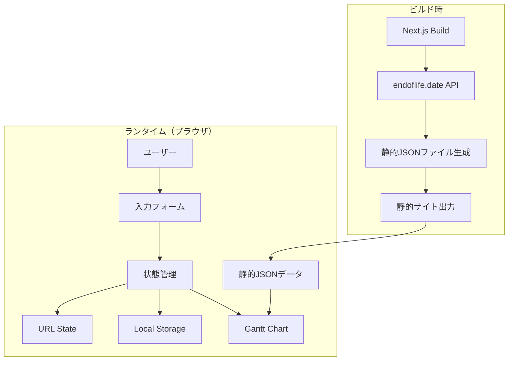

# 設計書

## 概要

EOL Timeline Viewerは、Next.jsで構築された静的Webアプリケーションで、複数のサービスで使用されている技術スタックのEnd of Life（EOL）情報をガントチャート形式で視覚化します。endoflife.date APIからビルド時にデータを取得し、@svar-ui/react-ganttライブラリを使用してインタラクティブなタイムラインを表示します。

### 主要機能

- サービスと技術スタックの入力フォーム
- endoflife.date APIからのEOLデータ取得（ビルド時）
- ガントチャート形式でのタイムライン表示
- URLパラメータによる状態の共有
- ローカルストレージによるデータ永続化
- レスポンシブデザイン

## アーキテクチャ

### 技術スタック

- **フレームワーク**: Next.js 14+ (App Router)
- **言語**: TypeScript
- **UIライブラリ**: React 18+
- **ガントチャート**: @svar-ui/react-gantt
- **スタイリング**: Tailwind CSS
- **ビルド**: 静的エクスポート（next export）
- **データソース**: endoflife.date API

### アーキテクチャ図



### データフロー

1. **ビルド時**: endoflife.date APIから全製品のEOL情報を取得し、静的JSONファイルとして保存
2. **初期化時**: URLパラメータまたはローカルストレージから状態を復元
3. **入力時**: ユーザー入力を状態に反映し、URLとローカルストレージを更新
4. **表示時**: 状態とEOLデータを結合してガントチャート用のデータ構造を生成

## コンポーネントとインターフェース

### コンポーネント構成

```
app/
├── page.tsx                    # メインページ
├── layout.tsx                  # ルートレイアウト
└── components/
    ├── ServiceForm.tsx         # サービス入力フォーム
    ├── TechnologyInput.tsx     # 技術スタック入力
    ├── EOLGanttChart.tsx       # ガントチャート表示
    └── ErrorBoundary.tsx       # エラーハンドリング

lib/
├── eol-data.ts                 # EOLデータ取得・管理
├── url-state.ts                # URL状態管理
├── storage.ts                  # ローカルストレージ管理
├── gantt-adapter.ts            # Ganttデータ変換
└── types.ts                    # 型定義

scripts/
└── fetch-eol-data.ts           # ビルド時データ取得スクリプト

public/
└── data/
    └── eol-data.json           # 静的EOLデータ
```

### 主要コンポーネント

#### 1. ServiceForm

サービスと技術スタックの入力を管理するフォームコンポーネント。

**Props:**
```typescript
interface ServiceFormProps {
  services: Service[];
  onServicesChange: (services: Service[]) => void;
}
```

**責務:**
- サービスの追加・削除
- 技術スタックの追加・削除
- バリデーション
- エラー表示

#### 2. TechnologyInput

個別の技術スタック入力フィールド。

**Props:**
```typescript
interface TechnologyInputProps {
  technology: Technology;
  availableTechnologies: string[];
  onChange: (technology: Technology) => void;
  onRemove: () => void;
}
```

**責務:**
- 技術名の入力（オートコンプリート）
- バージョンの入力
- 入力バリデーション

#### 3. EOLGanttChart

ガントチャートを表示するコンポーネント。

**Props:**
```typescript
interface EOLGanttChartProps {
  services: Service[];
  eolData: EOLDataMap;
}
```

**責務:**
- ガントチャートデータの生成
- @svar-ui/react-ganttの統合
- ツールチップ表示
- レスポンシブ対応

## データモデル

### 型定義

```typescript
// サービス定義
interface Service {
  id: string;
  name: string;
  technologies: Technology[];
}

// 技術スタック定義
interface Technology {
  id: string;
  name: string;           // 例: "python", "nodejs"
  currentVersion: string; // 例: "3.9"
}

// EOLデータ（endoflife.date APIから取得）
interface EOLCycle {
  cycle: string;          // バージョン番号
  releaseDate: string;    // リリース日（ISO 8601）
  eol: string | boolean;  // EOL日（ISO 8601）またはfalse
  support?: string;       // サポート終了日（オプション）
  lts?: boolean;          // LTSかどうか
}

interface EOLProduct {
  productName: string;
  cycles: EOLCycle[];
}

type EOLDataMap = Record<string, EOLProduct>;

// ガントチャート用データ構造
interface GanttTask {
  id: string | number;
  text: string;           // 表示名
  start: Date;            // 開始日
  end: Date;              // 終了日
  type: "task" | "summary";
  parent?: string | number;
  progress?: number;
  details?: {
    version: string;
    eolDate: string;
    isEOL: boolean;
  };
}

interface GanttLink {
  id: string | number;
  source: string | number;
  target: string | number;
  type: string;
}

interface GanttScale {
  unit: "year" | "month" | "day";
  step: number;
  format: string;
}
```

### URL状態エンコーディング

URLパラメータは以下の形式でエンコードされます：

```
?data=<base64-encoded-json>
```

エンコード前のJSON構造：
```typescript
interface URLState {
  version: number;  // スキーマバージョン
  services: Service[];
}
```

**エンコード処理:**
1. JSON.stringify()でシリアライズ
2. Base64エンコード
3. URLセーフな文字列に変換

**デコード処理:**
1. URLパラメータから取得
2. Base64デコード
3. JSON.parse()でデシリアライズ
4. バリデーション

## 正確性プロパティ

*プロパティとは、システムのすべての有効な実行において真であるべき特性や振る舞いのことです。プロパティは、人間が読める仕様と機械で検証可能な正確性保証の橋渡しとなります。*


### プロパティ1: 複数技術の追加

*任意の*サービスに対して、複数の技術を追加した場合、それらすべてが保持され、取得可能である
**検証: 要件 1.2**

### プロパティ2: URL状態のラウンドトリップ

*任意の*有効なサービスデータセットに対して、URL状態へのエンコードとデコードを行うと、元のデータと等価なデータが復元される
**検証: 要件 1.4, 4.1, 4.3**

### プロパティ3: 無効な入力の拒否

*任意の*無効な入力（空文字列、空白文字のみの文字列など）に対して、システムはエラーメッセージを表示し、データの追加を防止する
**検証: 要件 1.5, 8.1**

### プロパティ4: EOLデータフィールドの保持

*任意の*EOLデータに対して、リリース日、サポート終了日、拡張サポート終了日などのすべてのフィールドが取得後も保持される
**検証: 要件 2.2, 2.5**

### プロパティ5: 全サービスと技術の表示

*任意の*サービスセットに対して、すべてのサービスとそれに含まれるすべての技術が、ガントチャート上に個別の行として表示される
**検証: 要件 3.1, 3.2**

### プロパティ6: バージョン範囲の完全表示

*任意の*技術とバージョン範囲に対して、現在のバージョンから最新バージョンまでのすべての中間バージョンが表示される
**検証: 要件 3.3**

### プロパティ7: バーの期間の正確性

*任意の*バージョンに対して、ガントチャートのバーの開始日はリリース日と一致し、終了日はEOL日と一致する
**検証: 要件 3.4**

### プロパティ8: EOL状態の視覚的区別

*任意の*バージョンに対して、現在日付より前にEOLを迎えている場合、異なるスタイル（色など）が適用される
**検証: 要件 3.6**

### プロパティ9: URL長の制限遵守

*任意の*合理的なサイズのデータセットに対して、エンコード後のURL長がブラウザの制限（通常2048文字）を超えない
**検証: 要件 4.4**

### プロパティ10: ローカルストレージのラウンドトリップ

*任意の*有効なサービスデータセットに対して、ローカルストレージへの保存と読み込みを行うと、元のデータと等価なデータが復元される
**検証: 要件 6.1, 6.2**

## エラーハンドリング

### エラーの種類と対応

#### 1. 入力バリデーションエラー

**発生条件:**
- 空のサービス名
- 空の技術名
- 無効なバージョン形式

**対応:**
- フィールドレベルでのエラーメッセージ表示
- 送信ボタンの無効化
- エラー状態のクリア（修正時）

#### 2. データ取得エラー（ビルド時）

**発生条件:**
- endoflife.date APIへの接続失敗
- APIレスポンスの形式エラー
- タイムアウト

**対応:**
- エラーログの出力
- ビルドプロセスの失敗
- リトライロジック（最大3回）

#### 3. URL状態デコードエラー

**発生条件:**
- 不正なBase64文字列
- 不正なJSON形式
- スキーマバージョンの不一致

**対応:**
- ユーザーフレンドリーなエラーメッセージ表示
- 空の状態で初期化
- エラーの詳細をコンソールに記録

#### 4. ローカルストレージエラー

**発生条件:**
- ストレージ容量超過
- プライベートブラウジングモード
- ストレージアクセス拒否

**対応:**
- エラーを無視してURL状態のみ使用
- ユーザーに通知（オプション）
- 機能の部分的な動作継続

#### 5. 存在しない技術名

**発生条件:**
- endoflife.dateに存在しない技術名を入力

**対応:**
- 警告メッセージの表示
- その技術をスキップ
- 他の技術の表示は継続

### エラーバウンダリ

React Error Boundaryを使用して、予期しないエラーをキャッチします。

```typescript
class ErrorBoundary extends React.Component {
  state = { hasError: false, error: null };
  
  static getDerivedStateFromError(error) {
    return { hasError: true, error };
  }
  
  componentDidCatch(error, errorInfo) {
    console.error('Error caught by boundary:', error, errorInfo);
  }
  
  render() {
    if (this.state.hasError) {
      return <ErrorFallback error={this.state.error} />;
    }
    return this.props.children;
  }
}
```

## テスト戦略

### デュアルテストアプローチ

このプロジェクトでは、単体テストとプロパティベーステストの両方を使用します：

- **単体テスト**: 特定の例、エッジケース、エラー条件を検証
- **プロパティテスト**: すべての入力にわたる普遍的なプロパティを検証

両方のアプローチは補完的であり、包括的なカバレッジに必要です。

### 単体テストのバランス

単体テストは特定の例とエッジケースに焦点を当てます：

- **特定の例**: 正しい動作を示す具体的なケース
- **統合ポイント**: コンポーネント間の連携
- **エッジケースとエラー条件**: 境界値や異常系

プロパティテストは以下に焦点を当てます：

- **普遍的なプロパティ**: すべての入力に対して成り立つ性質
- **包括的な入力カバレッジ**: ランダム化による広範なテスト

### プロパティベーステスト設定

**使用ライブラリ**: fast-check（TypeScript/JavaScript用）

**設定:**
- 各プロパティテストは最小100回の反復を実行
- 各テストは設計書のプロパティを参照
- タグ形式: **Feature: eol-timeline-viewer, Property {番号}: {プロパティテキスト}**

### テストカテゴリ

#### 1. URL状態管理テスト

**単体テスト:**
- 空のデータセットのエンコード/デコード
- 単一サービスのエンコード/デコード
- 不正なURL文字列のデコードエラー

**プロパティテスト:**
- プロパティ2: URL状態のラウンドトリップ
- プロパティ9: URL長の制限遵守

#### 2. ローカルストレージテスト

**単体テスト:**
- ストレージへの保存と読み込み
- ストレージのクリア
- URL状態の優先順位

**プロパティテスト:**
- プロパティ10: ローカルストレージのラウンドトリップ

#### 3. データ変換テスト

**単体テスト:**
- 単一バージョンのGanttタスク変換
- 複数バージョンのGanttタスク変換
- EOL済みバージョンのスタイリング

**プロパティテスト:**
- プロパティ5: 全サービスと技術の表示
- プロパティ6: バージョン範囲の完全表示
- プロパティ7: バーの期間の正確性
- プロパティ8: EOL状態の視覚的区別

#### 4. バリデーションテスト

**単体テスト:**
- 空のサービス名の拒否
- 空の技術名の拒否
- 有効な入力の受け入れ

**プロパティテスト:**
- プロパティ3: 無効な入力の拒否

#### 5. EOLデータ処理テスト

**単体テスト:**
- APIレスポンスのパース
- 存在しない技術名の処理
- APIエラーの処理

**プロパティテスト:**
- プロパティ4: EOLデータフィールドの保持

#### 6. コンポーネント統合テスト

**単体テスト:**
- フォーム送信フロー
- サービス追加/削除
- 技術追加/削除
- ガントチャートのレンダリング

### テスト実行

```bash
# すべてのテストを実行
npm test

# プロパティテストのみ実行
npm test -- --testNamePattern="Property"

# カバレッジレポート生成
npm test -- --coverage
```

### 継続的インテグレーション

- すべてのプルリクエストでテストを自動実行
- カバレッジ閾値: 80%以上
- プロパティテストの失敗は即座にビルドを失敗させる

## 実装の詳細

### ビルド時データ取得

`scripts/fetch-eol-data.ts`でendoflife.date APIからデータを取得します：

```typescript
async function fetchEOLData() {
  // 1. 全製品リストを取得
  const products = await fetch('https://endoflife.date/api/all.json')
    .then(res => res.json());
  
  // 2. 各製品の詳細を取得
  const eolData: EOLDataMap = {};
  for (const product of products) {
    const cycles = await fetch(`https://endoflife.date/api/${product}.json`)
      .then(res => res.json());
    eolData[product] = { productName: product, cycles };
  }
  
  // 3. JSONファイルとして保存
  await fs.writeFile(
    'public/data/eol-data.json',
    JSON.stringify(eolData, null, 2)
  );
}
```

### ガントチャートデータ変換

サービスデータをGanttチャート形式に変換します：

```typescript
function convertToGanttData(
  services: Service[],
  eolData: EOLDataMap
): { tasks: GanttTask[]; scales: GanttScale[] } {
  const tasks: GanttTask[] = [];
  let taskId = 1;
  
  for (const service of services) {
    // サービスをサマリータスクとして追加
    const serviceId = taskId++;
    tasks.push({
      id: serviceId,
      text: service.name,
      start: new Date(),
      end: new Date(),
      type: 'summary',
    });
    
    for (const tech of service.technologies) {
      const productData = eolData[tech.name];
      if (!productData) continue;
      
      // 現在バージョンから最新までのサイクルを取得
      const relevantCycles = getRelevantCycles(
        productData.cycles,
        tech.currentVersion
      );
      
      for (const cycle of relevantCycles) {
        const isEOL = isVersionEOL(cycle.eol);
        tasks.push({
          id: taskId++,
          text: `${tech.name} ${cycle.cycle}`,
          start: new Date(cycle.releaseDate),
          end: new Date(cycle.eol as string),
          type: 'task',
          parent: serviceId,
          progress: isEOL ? 100 : 0,
          details: {
            version: cycle.cycle,
            eolDate: cycle.eol as string,
            isEOL,
          },
        });
      }
    }
  }
  
  const scales: GanttScale[] = [
    { unit: 'year', step: 1, format: 'YYYY' },
    { unit: 'month', step: 1, format: 'MMM' },
  ];
  
  return { tasks, scales };
}
```

### レスポンシブデザイン

Tailwind CSSのブレークポイントを使用：

```typescript
// モバイル: < 640px
// タブレット: 640px - 1024px
// デスクトップ: > 1024px

<div className="container mx-auto px-4">
  <div className="grid grid-cols-1 lg:grid-cols-2 gap-4">
    <div className="order-2 lg:order-1">
      {/* フォーム */}
    </div>
    <div className="order-1 lg:order-2 overflow-x-auto">
      {/* ガントチャート */}
    </div>
  </div>
</div>
```

### パフォーマンス最適化

1. **メモ化**: React.memoとuseMemoを使用して不要な再レンダリングを防止
2. **遅延読み込み**: ガントチャートコンポーネントの動的インポート
3. **データキャッシング**: EOLデータは静的ファイルとして事前生成
4. **デバウンス**: URL更新とローカルストレージ保存をデバウンス

## デプロイメント

### ビルドプロセス

```bash
# 1. EOLデータを取得
npm run fetch-eol-data

# 2. Next.jsアプリをビルド
npm run build

# 3. 静的ファイルをエクスポート
npm run export
```

### next.config.js設定

```javascript
/** @type {import('next').NextConfig} */
const nextConfig = {
  output: 'export',
  images: {
    unoptimized: true,
  },
  trailingSlash: true,
};

module.exports = nextConfig;
```

### ホスティングオプション

- **Vercel**: 自動デプロイメント、プレビュー環境
- **Netlify**: 継続的デプロイメント、フォーム処理
- **GitHub Pages**: 無料ホスティング、カスタムドメイン対応
- **AWS S3 + CloudFront**: スケーラブル、低コスト

## セキュリティ考慮事項

1. **XSS対策**: Reactの自動エスケープを活用
2. **URL検証**: デコード時のスキーマバリデーション
3. **依存関係**: 定期的なセキュリティアップデート
4. **CSP**: Content Security Policyヘッダーの設定

## 将来の拡張性

### フェーズ2の機能候補

1. **エクスポート機能**: PDF/PNG形式でのタイムライン出力
2. **通知機能**: EOL接近時のアラート
3. **比較機能**: 複数のサービスセットの比較
4. **カスタムテーマ**: ダークモード、カラースキーム
5. **データインポート**: CSV/JSONファイルからのインポート

### 技術的な拡張ポイント

- **状態管理**: 複雑化した場合はZustandやJotaiの導入
- **フォーム管理**: React Hook Formの導入
- **バリデーション**: Zodスキーマバリデーション
- **テスト**: PlaywrightによるE2Eテスト
