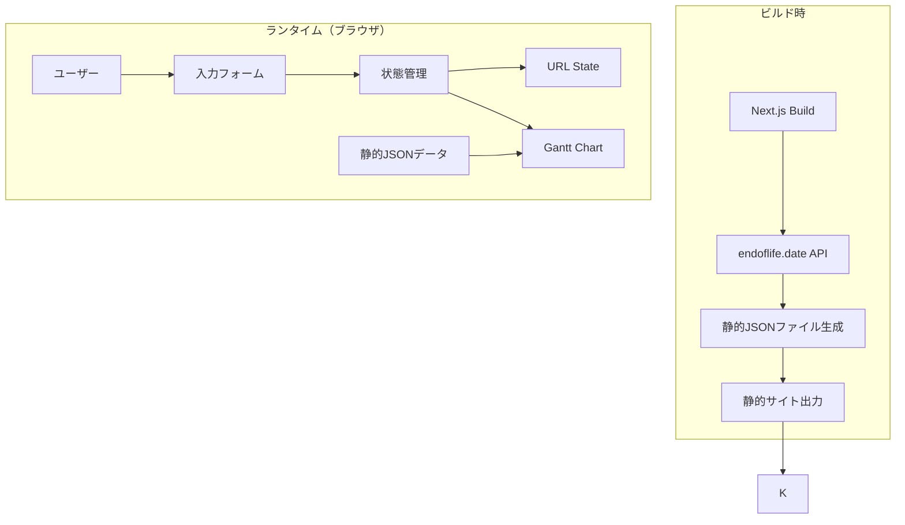

# 設計書

## 概要

EOL Timeline Viewerは、Next.jsで構築された静的Webアプリケーションで、複数のサービスで使用されている技術スタックのEnd of Life（EOL）情報をガントチャート形式で視覚化します。endoflife.date APIからビルド時にデータを取得し、@svar-ui/react-ganttライブラリを使用してインタラクティブなタイムラインを表示します。

### 主要機能

- サービスと技術スタックの入力フォーム
- endoflife.date APIからのEOLデータ取得（ビルド時）
- ガントチャート形式でのタイムライン表示
- URLパラメータによる状態の共有
- レスポンシブデザイン

## アーキテクチャ

### 技術スタック

- **フレームワーク**: Next.js 14+ (App Router)
- **言語**: TypeScript
- **UIライブラリ**: React 18+
- **ガントチャート**: gantt-task-react
- **スタイリング**: Tailwind CSS
- **ビルド**: 静的エクスポート（next export）
- **データソース**: endoflife.date API
- **テスト**: Jest + React Testing Library

### アーキテクチャ図



### データフロー

1. **ビルド時**: endoflife.date APIから全製品のEOL情報を取得し、静的JSONファイルとして保存
2. **初期化時**: URLパラメータから状態を復元（存在する場合）
3. **入力時**: ユーザー入力を状態に反映し、URLを更新
4. **表示時**: 状態とEOLデータを結合してガントチャート用のデータ構造を生成

## コンポーネントとインターフェース

### コンポーネント構成

```
app/
├── page.tsx                    # メインページ
├── layout.tsx                  # ルートレイアウト
└── globals.css                 # グローバルスタイル

components/
├── ServiceForm.tsx             # サービス入力フォーム
├── TechnologyInput.tsx         # 技術スタック入力
├── EOLGanttChart.tsx           # ガントチャート表示
└── ErrorBoundary.tsx           # エラーハンドリング

lib/
├── eol-data.ts                 # EOLデータ取得・管理
├── url-state.ts                # URL状態管理
├── gantt-adapter.ts            # Ganttデータ変換
├── validation.ts               # バリデーション
└── types.ts                    # 型定義

scripts/
└── fetch-eol-data.ts           # ビルド時データ取得スクリプト

public/
└── data/
    └── eol-data.json           # 静的EOLデータ
```

### 主要コンポーネント

#### 1. ServiceForm

サービスと技術スタックの入力を管理するフォームコンポーネント。

**Props:**
```typescript
interface ServiceFormProps {
  services: Service[];
  onServicesChange: (services: Service[]) => void;
}
```

**責務:**
- サービスの追加・削除
- 技術スタックの追加・削除
- バリデーション
- エラー表示

#### 2. TechnologyInput

個別の技術スタック入力フィールド。

**Props:**
```typescript
interface TechnologyInputProps {
  technology: Technology;
  availableTechnologies: string[];
  onChange: (technology: Technology) => void;
  onRemove: () => void;
}
```

**責務:**
- 技術名の入力（オートコンプリート）
- バージョンの入力
- 入力バリデーション

#### 3. EOLGanttChart

ガントチャートを表示するコンポーネント。

**Props:**
```typescript
interface EOLGanttChartProps {
  services: Service[];
  eolData: EOLDataMap;
}
```

**責務:**
- ガントチャートデータの生成
- gantt-task-reactの統合
- サービスごとの独立したチャート表示
- ライフサイクルステージの色分け表示
- セグメント表示（期間ごとの色分け）
- 現在使用中バージョンのマーカー表示
- ツールチップ表示
- レスポンシブ対応
- 凡例表示

## データモデル

### 型定義

```typescript
// サービス定義
interface Service {
  id: string;
  name: string;
  technologies: Technology[];
}

// 技術スタック定義
interface Technology {
  id: string;
  name: string;           // 例: "python", "nodejs"
  currentVersion: string; // 例: "3.9"
}

// EOLデータ（endoflife.date APIから取得）
interface EOLCycle {
  cycle: string;          // バージョン番号
  releaseDate: string;    // リリース日（ISO 8601）
  eol: string | boolean;  // EOL日（ISO 8601）またはfalse
  support?: string;       // サポート終了日（オプション）
  lts?: boolean;          // LTSかどうか
}

interface EOLProduct {
  productName: string;
  cycles: EOLCycle[];
}

type EOLDataMap = Record<string, EOLProduct>;

// ガントチャート用データ構造（gantt-task-react用）
type LifecycleStage = 'current' | 'active' | 'maintenance' | 'eol';

interface GanttTask {
  id: string | number;
  text: string;           // 表示名
  start: Date;            // 開始日
  end: Date;              // 終了日
  type: "task" | "summary";
  parent?: string | number;
  progress?: number;
  css?: string;           // カスタムCSSクラス
  segments?: Array<{      // セグメント表示用
    start: Date;
    end: Date;
    stage: LifecycleStage;
  }>;
  details?: string;       // JSON文字列化された詳細情報
}

interface GanttScale {
  unit: "year" | "month" | "day";
  step: number;
  format: string;
}
```

### ライフサイクルステージの詳細

バージョンのライフサイクルステージは、endoflife.date APIから取得した実際の日付フィールド（`lts`、`support`、`eol`）に基づいて判定されます。

#### ステージ定義

| ステージ | 色 | カラーコード | 意味 |
|---------|-----|------------|------|
| **current** | 緑 | #22c55e | 最新・推奨バージョン（LTS開始前） |
| **active** | 青 | #3b82f6 | アクティブサポート中 |
| **maintenance** | グレー | #94a3b8 | メンテナンスモード（セキュリティ修正のみ） |
| **eol** | 赤 | #ef4444 | サポート終了済み |

#### 判定ロジック

endoflife.date APIのデータ構造に基づいて判定します。

**判定表:**

| パターン | ltsフィールド | supportフィールド | 期間1 | 期間2 | 期間3 | 具体例 |
|---------|-------------|-----------------|-------|-------|-------|--------|
| **1. LTS日付あり** | 文字列（日付） | あり | releaseDate → lts<br/>**current**（緑） | lts → support<br/>**active**（青） | support → eol<br/>**maintenance**（グレー） | Node.js LTS |
| **2. supportあり** | false | あり | releaseDate → support<br/>**active**（青） | support → eol<br/>**maintenance**（グレー） | - | Rails、Python、PHP、Node.js非LTS |
| **3. supportなし** | false | なし | releaseDate → eol<br/>**active**（青） | - | - | Ruby、PostgreSQL、Go |
| **4. EOL済み** | - | - | 全期間<br/>**eol**（赤） | - | - | 過去のバージョン |

**データ例:**

```json
// パターン1: Node.js 24 LTS
{
  "cycle": "24",
  "releaseDate": "2025-05-06",
  "lts": "2025-10-28",        // LTS開始日（文字列）
  "support": "2026-10-20",    // アクティブサポート終了日
  "eol": "2028-04-30"
}

// パターン2: Rails 8.1
{
  "cycle": "8.1",
  "releaseDate": "2025-10-22",
  "support": "2026-10-10",    // サポート終了日
  "eol": "2027-10-10",
  "lts": false
}

// パターン3: Ruby 4.0
{
  "cycle": "4.0",
  "releaseDate": "2025-12-25",
  "eol": "2029-03-31",
  "lts": false
}

// パターン4: Python 3.9（EOL済み）
{
  "cycle": "3.9",
  "releaseDate": "2020-10-05",
  "eol": "2025-10-31",        // 過去の日付
  "lts": false
}
```

**判定ルール:**
1. EOL日が現在より過去 → **eol**（全期間）
2. `lts`フィールドが文字列（日付）の場合 → パターン1
3. `support`フィールドがある場合 → パターン2
4. `support`フィールドがない場合 → パターン3

```typescript

### URL状態エンコーディング

URLパラメータは人間が読みやすいセミコロン区切り形式でエンコードされます：

```
?s=サービス名(技術:バージョン,技術:バージョン);サービス名(技術:バージョン)
```

**フォーマット仕様:**
- サービスは `;` (セミコロン) で区切る
- 各サービスは `サービス名(技術リスト)` の形式
- 技術リストは括弧 `()` で囲む
- 技術は `,` (カンマ) で区切る
- 各技術は `技術名:バージョン` の形式（`:` で区切る）

**具体例:**

```
# 単一サービス、複数技術
?s=myapp(python:3.9,nodejs:18.0)

# 複数サービス
?s=myapp(python:3.9,nodejs:18.0);api(go:1.20,postgres:15)

# 3つのサービス
?s=web(react:18,nodejs:20);api(python:3.11);db(postgres:15)
```

**エンコード処理:**
1. 各サービスを処理
2. 技術は `技術名:バージョン` 形式で `,` で結合
3. 技術リストを括弧 `()` で囲む
4. サービス名と技術リストを結合
5. サービスを `;` で結合
6. 特殊文字（`:`, `;`, `,`, `(`, `)`）をURLエンコード（`encodeURIComponent`）

**デコード処理:**
1. URLパラメータから取得（`decodeURIComponent`）
2. `;` でサービスに分割
3. 各サービスを `(` でサービス名と技術リストに分割
4. 技術リストから末尾の `)` を削除
5. 技術リストを `,` で分割
6. 各技術を `:` で技術名とバージョンに分割
7. バリデーション

**エスケープ処理:**

サービス名、技術名、バージョンに特殊文字が含まれる場合は、`encodeURIComponent`でエスケープします：

```typescript
// エンコード例
const serviceName = "my-app [prod]";  // 括弧を含む
const encoded = encodeURIComponent(serviceName);
// → "my-app%20%5Bprod%5D"

// デコード例
const decoded = decodeURIComponent(encoded);
// → "my-app [prod]"
```

**メリット:**
1. URLエンコード不要な文字のみ使用（括弧と `:` はエンコード不要）
2. `@` より見やすく、関数呼び出しのような自然な構文
3. より短いURL
4. 手動編集が容易
5. URLから直接サービス名、技術名、バージョンが読み取れる

## 正確性プロパティ

*プロパティとは、システムのすべての有効な実行において真であるべき特性や振る舞いのことです。プロパティは、人間が読める仕様と機械で検証可能な正確性保証の橋渡しとなります。*


### プロパティ1: 複数技術の追加

*任意の*サービスに対して、複数の技術を追加した場合、それらすべてが保持され、取得可能である
**検証: 要件 1.2**

### プロパティ2: URL状態のラウンドトリップ

*任意の*有効なサービスデータセットに対して、セミコロン区切り形式へのエンコードとデコードを行うと、元のデータと等価なデータが復元される
**検証: 要件 4.1, 4.2, 4.4**

### プロパティ3: 無効な入力の拒否

*任意の*無効な入力（空文字列、空白文字のみの文字列、長すぎる文字列など）に対して、システムはエラーメッセージを表示し、データの追加を防止する
**検証: 要件 1.5, 7.1**

### プロパティ4: EOLデータフィールドの保持

*任意の*EOLデータに対して、リリース日、サポート終了日、拡張サポート終了日などのすべてのフィールドが取得後も保持される
**検証: 要件 2.2, 2.5**

### プロパティ5: 全サービスと技術の表示

*任意の*サービスセットに対して、すべてのサービスとそれに含まれるすべての技術が、ガントチャート上に個別の行として表示される
**検証: 要件 3.1, 3.2**

### プロパティ6: バージョン範囲の完全表示

*任意の*技術とバージョン範囲に対して、現在のバージョン以降のすべてのバージョンが表示される（中間バージョンを含む）
**検証: 要件 3.3**

### プロパティ7: バーの期間の正確性

*任意の*バージョンに対して、ガントチャートのバーの開始日はリリース日と一致し、終了日はEOL日と一致する
**検証: 要件 3.4**

### プロパティ8: EOL状態の視覚的区別

*任意の*バージョンに対して、そのライフサイクルステージ（current、active、maintenance、eol）に応じて異なるスタイル（色）が適用される
**検証: 要件 3.6**

### プロパティ9: セグメント表示の正確性

*任意の*バージョンに対して、ライフサイクルステージの期間ごとに正しい色でセグメント分割されて表示される
**検証: 要件 3.10**


### プロパティ9: URL長の制限遵守

*任意の*合理的なサイズのデータセットに対して、セミコロン区切り形式でエンコード後のURL長がブラウザの制限（通常2048文字）を超えない
**検証: 要件 4.5**

## エラーハンドリング

### エラーの種類と対応

#### 1. 入力バリデーションエラー

**発生条件:**
- 空のサービス名
- 空の技術名
- 無効なバージョン形式

**対応:**
- フィールドレベルでのエラーメッセージ表示
- 送信ボタンの無効化
- エラー状態のクリア（修正時）

#### 2. データ取得エラー（ビルド時）

**発生条件:**
- endoflife.date APIへの接続失敗
- APIレスポンスの形式エラー
- タイムアウト

**対応:**
- エラーログの出力
- リトライロジック（最大3回、1秒間隔）
- API制限を避けるための待機時間
- 成功率が低い場合の警告表示
- 個別の製品取得失敗時は空配列を返してスキップ

#### 3. URL状態デコードエラー

**発生条件:**
- 不正なフォーマット（区切り文字の誤り）
- 不正なエスケープシーケンス
- 必須フィールドの欠落（サービス名、技術名、バージョン）

**対応:**
- ユーザーフレンドリーなエラーメッセージ表示
- 空の状態で初期化
- エラーの詳細をコンソールに記録

#### 4. 存在しない技術名

**発生条件:**
- endoflife.dateに存在しない技術名を入力

**対応:**
- コンソールに警告メッセージを出力
- その技術をスキップ
- 他の技術の表示は継続
- ユーザーには空のチャートまたは部分的なチャートを表示

#### 5. URL長制限超過

**発生条件:**
- エンコード後のURLが2048文字を超える

**対応:**
- ユーザーに通知メッセージを表示
- データの追加を防止または警告
- 現在のURL長を表示

### エラーバウンダリ

React Error Boundaryを使用して、予期しないエラーをキャッチします。

```typescript
class ErrorBoundary extends React.Component {
  state = { hasError: false, error: null };
  
  static getDerivedStateFromError(error) {
    return { hasError: true, error };
  }
  
  componentDidCatch(error, errorInfo) {
    console.error('Error caught by boundary:', error, errorInfo);
  }
  
  render() {
    if (this.state.hasError) {
      return (
        <div className="min-h-screen flex items-center justify-center">
          <div className="text-center">
            <h2>エラーが発生しました</h2>
            <p>ページを再読み込みしてください</p>
            <button onClick={() => window.location.reload()}>
              再読み込み
            </button>
          </div>
        </div>
      );
    }
    return this.props.children;
  }
}
```

## テスト戦略

### デュアルテストアプローチ

このプロジェクトでは、単体テストとプロパティベーステストの両方を使用します：

- **単体テスト**: 特定の例、エッジケース、エラー条件を検証
- **プロパティテスト**: すべての入力にわたる普遍的なプロパティを検証

両方のアプローチは補完的であり、包括的なカバレッジに必要です。

### 単体テストのバランス

単体テストは特定の例とエッジケースに焦点を当てます：

- **特定の例**: 正しい動作を示す具体的なケース
- **統合ポイント**: コンポーネント間の連携
- **エッジケースとエラー条件**: 境界値や異常系

プロパティテストは以下に焦点を当てます：

- **普遍的なプロパティ**: すべての入力に対して成り立つ性質
- **包括的な入力カバレッジ**: ランダム化による広範なテスト

### プロパティベーステスト設定

**使用ライブラリ**: fast-check（TypeScript/JavaScript用）

**設定:**
- 各プロパティテストは最小100回の反復を実行
- 各テストは設計書のプロパティを参照
- タグ形式: **Feature: eol-timeline-viewer, Property {番号}: {プロパティテキスト}**

### テストカテゴリ

#### 1. URL状態管理テスト

**単体テスト:**
- 空のデータセットのエンコード/デコード
- 単一サービスのエンコード/デコード
- 不正なURL文字列のデコードエラー

**プロパティテスト:**
- プロパティ2: URL状態のラウンドトリップ
- プロパティ9: URL長の制限遵守

#### 2. データ変換テスト

**単体テスト:**
- 単一バージョンのGanttタスク変換
- 複数バージョンのGanttタスク変換
- EOL済みバージョンのスタイリング
- ライフサイクルステージの判定
- セグメント分割の正確性

**プロパティテスト:**
- プロパティ5: 全サービスと技術の表示
- プロパティ6: バージョン範囲の完全表示
- プロパティ7: バーの期間の正確性
- プロパティ8: EOL状態の視覚的区別

#### 3. バリデーションテスト

**単体テスト:**
- 空のサービス名の拒否
- 空の技術名の拒否
- 有効な入力の受け入れ

**プロパティテスト:**
- プロパティ3: 無効な入力の拒否

#### 4. EOLデータ処理テスト

**単体テスト:**
- APIレスポンスのパース
- 存在しない技術名の処理
- APIエラーの処理

**プロパティテスト:**
- プロパティ4: EOLデータフィールドの保持

#### 5. コンポーネント統合テスト

**単体テスト:**
- フォーム送信フロー
- サービス追加/削除
- 技術追加/削除
- ガントチャートのレンダリング
- オートコンプリート機能
- データクリア機能
- 通知表示機能

### テスト実行

```bash
# すべてのテストを実行
npm test

# プロパティテストのみ実行
npm test -- --testNamePattern="Property"

# カバレッジレポート生成
npm test -- --coverage
```

### 継続的インテグレーション

- すべてのプルリクエストでテストを自動実行
- カバレッジ閾値: 80%以上
- プロパティテストの失敗は即座にビルドを失敗させる

## 実装の詳細

### ビルド時データ取得

`scripts/fetch-eol-data.ts`でendoflife.date APIからデータを取得します：

```typescript
async function fetchEOLData(limitProducts?: number) {
  // 1. 全製品リストを取得
  const products = await fetch('https://endoflife.date/api/all.json')
    .then(res => res.json());
  
  // 2. 各製品の詳細を取得（リトライロジック付き）
  const eolData: EOLDataMap = {};
  for (const product of products) {
    const cycles = await fetchWithRetry(
      `https://endoflife.date/api/${product}.json`,
      3,  // 最大3回リトライ
      1000 // 1秒待機
    );
    eolData[product] = { productName: product, cycles };
    
    // API制限を避けるため待機
    if (processedCount % 10 === 0) {
      await delay(1000);
    }
  }
  
  // 3. JSONファイルとして保存
  await fs.writeFile(
    'public/data/eol-data.json',
    JSON.stringify(eolData, null, 2)
  );
}
```

### ガントチャートデータ変換

サービスデータをGanttチャート形式に変換します：

```typescript
function convertToGanttData(
  services: Service[],
  eolData: EOLDataMap
): { tasks: GanttTask[]; scales: GanttScale[] } {
  const tasks: GanttTask[] = [];
  let taskId = 1;
  
  for (const service of services) {
    // 技術ごとに処理（サービスごとに独立したチャート）
    for (const tech of service.technologies) {
      const productData = eolData[tech.name];
      if (!productData) continue;
      
      // 現在バージョン以降のサイクルを取得
      const relevantCycles = getRelevantCycles(
        productData.cycles,
        tech.currentVersion
      );
      
      for (const cycle of relevantCycles) {
        const isCurrentVersion = compareVersions(cycle.cycle, tech.currentVersion) === 0;
        
        // ライフサイクルステージを計算
        const lifecycleStage = getLifecycleStage(cycle, startDate, endDate);
        
        // 期間をセグメントに分割
        const segments = calculateStages(startDate, endDate, cycle.lts || false);
        
        tasks.push({
          id: taskId++,
          text: `${tech.name} ${cycle.cycle}${isCurrentVersion ? ' ★' : ''}`,
          start: new Date(cycle.releaseDate),
          end: new Date(cycle.eol as string),
          type: 'task',
          progress: 0,
          css: `stage-${lifecycleStage}${isCurrentVersion ? ' current-version' : ''}`,
          segments: segments.map(seg => ({
            start: seg.start,
            end: seg.end,
            stage: seg.stage,
          })),
          details: JSON.stringify({
            version: cycle.cycle,
            eolDate: cycle.eol,
            releaseDate: cycle.releaseDate,
            stage: lifecycleStage,
            lts: cycle.lts || false,
            techName: tech.name,
            serviceName: service.name,
            isCurrentVersion,
          }),
        });
      }
    }
  }
  
  const scales: GanttScale[] = [
    { unit: 'year', step: 1, format: 'YYYY' },
    { unit: 'month', step: 1, format: 'MMM' },
  ];
  
  return { tasks, scales };
}

// ライフサイクルステージを判定
function getLifecycleStage(
  cycle: EOLCycle,
  startDate: Date,
  endDate: Date
): 'current' | 'active' | 'maintenance' | 'eol' {
  const now = new Date();
  
  // EOL済み（サポート終了）
  if (endDate < now) return 'eol';
  
  // パターン1: LTSバージョン（ltsフィールドが日付文字列）
  if (cycle.lts && typeof cycle.lts === 'string') {
    const ltsDate = new Date(cycle.lts);
    if (cycle.support && typeof cycle.support === 'string') {
      const supportDate = new Date(cycle.support);
      // 現在日時がどの期間にあるかで判定
      if (now < ltsDate) return 'current';
      if (now < supportDate) return 'active';
      return 'maintenance';
    }
    // supportがない場合
    if (now < ltsDate) return 'current';
    return 'active';
  }
  
  // パターン2: 非LTSバージョンでsupportあり
  if (cycle.support && typeof cycle.support === 'string') {
    const supportDate = new Date(cycle.support);
    if (now < supportDate) return 'active';
    return 'maintenance';
  }
  
  // パターン3: supportフィールドがない場合
  return 'active';
}

// 期間をステージごとに分割
function calculateStages(
  cycle: EOLCycle,
  startDate: Date,
  endDate: Date
): Array<{ start: Date; end: Date; stage: LifecycleStage }> {
  const now = new Date();
  
  // EOL済みの場合は全期間を赤色で表示
  if (endDate < now) {
    return [{
      start: startDate,
      end: endDate,
      stage: 'eol'
    }];
  }
  
  // パターン1: LTSバージョン（ltsフィールドが日付文字列）
  if (cycle.lts && typeof cycle.lts === 'string') {
    const ltsDate = new Date(cycle.lts);
    const segments: Array<{ start: Date; end: Date; stage: LifecycleStage }> = [];
    
    // releaseDate → lts: current（緑）
    segments.push({
      start: startDate,
      end: ltsDate,
      stage: 'current'
    });
    
    // lts → support: active（青）
    if (cycle.support && typeof cycle.support === 'string') {
      const supportDate = new Date(cycle.support);
      segments.push({
        start: ltsDate,
        end: supportDate,
        stage: 'active'
      });
      
      // support → eol: maintenance（グレー）
      segments.push({
        start: supportDate,
        end: endDate,
        stage: 'maintenance'
      });
    } else {
      // supportがない場合は、lts → eol を active
      segments.push({
        start: ltsDate,
        end: endDate,
        stage: 'active'
      });
    }
    
    return segments;
  }
  
  // パターン2: 非LTSバージョンでsupportあり
  if (cycle.support && typeof cycle.support === 'string') {
    const supportDate = new Date(cycle.support);
    
    return [
      // releaseDate → support: active（青）
      {
        start: startDate,
        end: supportDate,
        stage: 'active'
      },
      // support → eol: maintenance（グレー）
      {
        start: supportDate,
        end: endDate,
        stage: 'maintenance'
      }
    ];
  }
  
  // パターン3: supportフィールドがない場合は、全期間をactiveとして表示
  return [{
    start: startDate,
    end: endDate,
    stage: 'active'
  }];
}
```

### レスポンシブデザイン

Tailwind CSSのブレークポイントを使用：

```typescript
// モバイル: < 640px (sm)
// タブレット: 640px - 1024px (md, lg)
// デスクトップ: > 1024px (xl)

<div className="container mx-auto px-4">
  <div className="flex flex-col gap-4 sm:gap-6 lg:gap-8">
    {/* ヘッダー */}
    <div className="flex flex-col sm:flex-row sm:justify-between sm:items-center">
      <h1 className="text-xl sm:text-2xl font-bold">EOL Timeline Viewer</h1>
      <button className="w-full sm:w-auto">データクリア</button>
    </div>
    
    {/* フォーム */}
    <div className="bg-white rounded-lg shadow-sm border p-4 sm:p-6">
      <ServiceForm services={services} onServicesChange={handleServicesChange} />
    </div>
    
    {/* ガントチャート */}
    <div className="bg-white rounded-lg shadow-sm border p-4 sm:p-6">
      <div className="overflow-x-auto">
        <EOLGanttChart services={services} eolData={eolData} />
      </div>
    </div>
  </div>
</div>
```

### パフォーマンス最適化

1. **メモ化**: React.memo、useMemo、useCallbackを使用して不要な再レンダリングを防止
2. **データキャッシング**: EOLデータは静的ファイルとして事前生成し、クライアント側でキャッシュ
3. **デバウンス**: URL更新をデバウンスして過度な履歴エントリを防止
4. **効率的なデータ構造**: サービスごとに独立したガントチャートを生成し、大規模データでもパフォーマンスを維持

## デプロイメント

### ビルドプロセス

```bash
# 1. EOLデータを取得
npm run fetch-eol-data
# または環境変数でテストモード
FETCH_LIMIT=20 npm run fetch-eol-data

# 2. Next.jsアプリをビルド
npm run build

# 3. 静的ファイルをエクスポート（next.config.jsでoutput: 'export'設定済み）
# ビルドコマンドに含まれる
```

### next.config.js設定

```javascript
/** @type {import('next').NextConfig} */
const nextConfig = {
  output: 'export',
  images: {
    unoptimized: true,
  },
  trailingSlash: true,
};

module.exports = nextConfig;
```

### ホスティングオプション

- **Vercel**: 自動デプロイメント、プレビュー環境
- **Netlify**: 継続的デプロイメント、フォーム処理
- **GitHub Pages**: 無料ホスティング、カスタムドメイン対応
- **AWS S3 + CloudFront**: スケーラブル、低コスト

## セキュリティ考慮事項

1. **XSS対策**: Reactの自動エスケープを活用
2. **URL検証**: デコード時のスキーマバリデーション
3. **依存関係**: 定期的なセキュリティアップデート
4. **CSP**: Content Security Policyヘッダーの設定

## 将来の拡張性

### フェーズ2の機能候補

1. **エクスポート機能**: PDF/PNG形式でのタイムライン出力
2. **通知機能**: EOL接近時のアラート
3. **比較機能**: 複数のサービスセットの比較
4. **カスタムテーマ**: ダークモード、カラースキーム
5. **データインポート**: CSV/JSONファイルからのインポート

### 技術的な拡張ポイント

- **状態管理**: 複雑化した場合はZustandやJotaiの導入
- **フォーム管理**: React Hook Formの導入
- **バリデーション**: Zodスキーマバリデーション
- **テスト**: PlaywrightによるE2Eテスト
