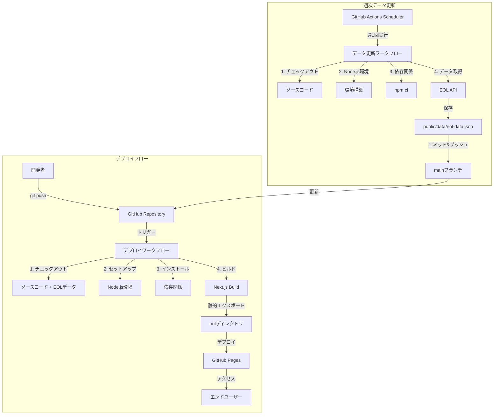

# 設計ドキュメント

## 概要

本ドキュメントは、EOLタイムラインビューアーアプリケーションをGitHub Pagesにデプロイするための技術設計を定義します。Next.jsの静的エクスポート機能を使用し、GitHub Actionsによる自動デプロイパイプラインを構築します。

## アーキテクチャ

### システム構成図



### ワークフロー

#### データ更新フロー（週次）

1. **トリガー**: GitHub Actionsスケジューラー（毎週日曜日 0:00 UTC）
2. **環境構築**: Node.js環境のセットアップ
3. **依存関係インストール**: npm ciによる依存関係の確定的インストール
4. **データ取得**: EOL APIからデータを取得してpublic/data/eol-data.jsonに保存
5. **コミット**: 変更があればmainブランチにコミット・プッシュ
6. **デプロイトリガー**: mainブランチへのプッシュにより自動的にデプロイワークフローが実行

#### デプロイフロー（プッシュ時）

1. **トリガー**: mainブランチへのプッシュ
2. **環境構築**: Node.js環境のセットアップとキャッシュ復元
3. **依存関係インストール**: npm ciによる依存関係の確定的インストール
4. **ビルド**: リポジトリ内の既存EOLデータを使用してNext.jsの静的エクスポート実行
5. **デプロイ**: 生成されたoutディレクトリをGitHub Pagesにデプロイ
6. **公開**: GitHub Pagesが自動的にサイトを更新

## コンポーネントとインターフェース

### 1. Next.js設定（next.config.js）

既存の設定を拡張し、GitHub Pages対応を追加します。

```javascript
/** @type {import('next').NextConfig} */
const nextConfig = {
  // 静的エクスポート設定（要件 1.1）
  output: 'export',
  
  // 画像最適化設定（要件 4.2）
  images: {
    unoptimized: true,
  },
  
  // 静的ホスティング対応（要件 1.4）
  trailingSlash: true,
  
  // ベースパス設定（要件 2.1, 2.5）
  basePath: process.env.NEXT_PUBLIC_BASE_PATH || '',
  
  // アセットプレフィックス設定（要件 4.4）
  assetPrefix: process.env.NEXT_PUBLIC_BASE_PATH || '',
  
  // ESLint設定
  eslint: {
    dirs: ['app', 'lib', 'components', 'scripts'],
  },
  
  // TypeScript設定（要件 7.5）
  typescript: {
    ignoreBuildErrors: false,
  },
  
  // ビルドID生成（要件 7.4）
  generateBuildId: async () => {
    return `eol-timeline-viewer-${new Date().toISOString().slice(0, 10)}`;
  },
};

module.exports = nextConfig;
```

**インターフェース**:
- 入力: 環境変数（NEXT_PUBLIC_BASE_PATH）
- 出力: Next.jsビルド設定オブジェクト

### 2. データ更新ワークフロー（.github/workflows/update-eol-data.yml）

```yaml
name: Update EOL Data

on:
  schedule:
    # 毎週日曜日 0:00 UTC（日本時間 9:00）に実行
    - cron: '0 0 * * 0'
  workflow_dispatch:  # 手動実行も可能

permissions:
  contents: write

jobs:
  update-data:
    runs-on: ubuntu-latest
    
    steps:
      # ソースコードのチェックアウト
      - name: Checkout
        uses: actions/checkout@v4
        with:
          token: ${{ secrets.GITHUB_TOKEN }}
      
      # Node.js環境のセットアップ
      - name: Setup Node.js
        uses: actions/setup-node@v4
        with:
          node-version: '20'
          cache: 'npm'
      
      # 依存関係のインストール
      - name: Install dependencies
        run: npm ci
      
      # EOLデータの取得
      - name: Fetch EOL data
        run: npm run fetch-eol-data
        env:
          NODE_ENV: production
      
      # 変更の確認とコミット
      - name: Check for changes
        id: git-check
        run: |
          git diff --exit-code public/data/eol-data.json || echo "changed=true" >> $GITHUB_OUTPUT
      
      # 変更があればコミット・プッシュ
      - name: Commit and push if changed
        if: steps.git-check.outputs.changed == 'true'
        run: |
          git config --local user.email "github-actions[bot]@users.noreply.github.com"
          git config --local user.name "github-actions[bot]"
          git add public/data/eol-data.json
          git commit -m "chore: update EOL data [skip ci]"
          git push
      
      # 変更がない場合のログ
      - name: No changes
        if: steps.git-check.outputs.changed != 'true'
        run: echo "No changes in EOL data"
```

**インターフェース**:
- トリガー: スケジュール（週次）または手動実行
- 入力: なし
- 出力: 更新されたeol-data.json（変更がある場合）、コミットハッシュ

**設計上の考慮事項**:
- `[skip ci]`をコミットメッセージに含めることで、データ更新のコミットが無限ループを引き起こさないようにする
- `workflow_dispatch`により手動実行も可能にし、緊急時のデータ更新に対応
- 変更がない場合はコミットをスキップし、不要なコミット履歴を避ける

### 3. デプロイワークフロー（.github/workflows/deploy.yml）

```yaml
name: Deploy to GitHub Pages

on:
  push:
    branches:
      - main  # 要件 3.1
    paths-ignore:
      - '**.md'  # ドキュメント変更のみの場合はスキップ

permissions:
  contents: read
  pages: write
  id-token: write

concurrency:
  group: "pages"
  cancel-in-progress: false

jobs:
  build:
    runs-on: ubuntu-latest
    
    steps:
      # ソースコードのチェックアウト
      - name: Checkout
        uses: actions/checkout@v4
      
      # Node.js環境のセットアップ（要件 3.2）
      - name: Setup Node.js
        uses: actions/setup-node@v4
        with:
          node-version: '20'
          cache: 'npm'  # 要件 7.1
      
      # 依存関係のインストール（要件 3.3）
      - name: Install dependencies
        run: npm ci
      
      # EOLデータの存在確認
      - name: Verify EOL data exists
        run: |
          if [ ! -f public/data/eol-data.json ]; then
            echo "Error: EOL data file not found"
            exit 1
          fi
      
      # Next.jsビルドキャッシュの復元（要件 7.2）
      - name: Restore Next.js build cache
        uses: actions/cache@v4
        with:
          path: |
            .next/cache
          key: ${{ runner.os }}-nextjs-${{ hashFiles('**/package-lock.json') }}-${{ hashFiles('**/*.js', '**/*.jsx', '**/*.ts', '**/*.tsx') }}
          restore-keys: |
            ${{ runner.os }}-nextjs-${{ hashFiles('**/package-lock.json') }}-
      
      # アプリケーションのビルド（要件 3.5）
      - name: Build application
        run: npm run build
        env:
          NEXT_PUBLIC_BASE_PATH: /eol-checker  # 要件 2.5, 5.2
          NODE_ENV: production
      
      # GitHub Pagesのセットアップ
      - name: Setup Pages
        uses: actions/configure-pages@v4
      
      # ビルド成果物のアップロード
      - name: Upload artifact
        uses: actions/upload-pages-artifact@v3
        with:
          path: ./out  # 要件 1.2
  
  deploy:
    environment:
      name: github-pages
      url: ${{ steps.deployment.outputs.page_url }}  # 要件 6.2
    runs-on: ubuntu-latest
    needs: build
    
    steps:
      # GitHub Pagesへのデプロイ（要件 3.6）
      - name: Deploy to GitHub Pages
        id: deployment
        uses: actions/deploy-pages@v4
```

**インターフェース**:
- トリガー: mainブランチへのプッシュイベント（ドキュメントのみの変更は除外）
- 入力: ソースコード、リポジトリ内のEOLデータ、環境変数
- 出力: デプロイされたサイトURL、ビルドステータス

**設計上の考慮事項**:
- データ取得ステップを削除し、リポジトリ内の既存データを使用
- EOLデータファイルの存在確認ステップを追加し、データがない場合はビルドを失敗させる
- `paths-ignore`でドキュメント変更のみの場合はデプロイをスキップ

### 4. 環境変数設定

**開発環境（.env.local）**:
```bash
# ベースパスは開発環境では不要（要件 2.4）
NEXT_PUBLIC_BASE_PATH=
```

**本番環境（GitHub Actions）**:
```yaml
env:
  NEXT_PUBLIC_BASE_PATH: /eol-checker  # 要件 2.1, 2.5
```

**インターフェース**:
- 変数名: `NEXT_PUBLIC_BASE_PATH`
- 型: string
- デフォルト値: 空文字列
- 使用箇所: next.config.js、ビルドプロセス

### 5. ベースパス対応コンポーネント

既存のコンポーネントは、Next.jsの`Link`コンポーネントと`Image`コンポーネントを使用しているため、自動的にベースパスが適用されます（要件 2.2, 2.3）。

**確認が必要な箇所**:
- 外部リンク: 絶対パスを使用している場合は影響なし
- 内部リンク: Next.jsの`Link`コンポーネントを使用していれば自動対応
- 画像: `next/image`を使用していれば自動対応
- 静的アセット: `/public`ディレクトリのファイルは自動対応

## データモデル

### ビルド成果物構造

```
out/
├── _next/
│   ├── static/
│   │   ├── chunks/        # JavaScriptチャンク
│   │   ├── css/           # CSSファイル
│   │   └── media/         # メディアファイル
│   └── ...
├── data/
│   └── eol-data.json      # EOLデータ
├── index.html             # トップページ
├── 404.html               # エラーページ
└── ...                    # その他の静的ページ
```

### デプロイメタデータ

```typescript
interface DeploymentMetadata {
  buildId: string;          // ビルドID
  timestamp: string;        // デプロイ日時
  commitSha: string;        // コミットハッシュ
  basePath: string;         // ベースパス
  nodeVersion: string;      // Node.jsバージョン
}
```

## 正確性プロパティ

*プロパティとは、システムのすべての有効な実行において真であるべき特性や動作のことです。これは、人間が読める仕様と機械で検証可能な正確性保証の橋渡しとなる形式的な記述です。*

### プロパティ1: ビルド成果物の完全性

*すべての*ビルド実行において、outディレクトリには必須ファイル（index.html、_nextディレクトリ、dataディレクトリ）が含まれている必要がある

**検証要件: 1.2**

### プロパティ2: アセット参照のベースパス適用

*すべての*生成されたHTMLファイルにおいて、内部リンク、CSS参照、JavaScript参照、画像参照は、設定されたベースパスで始まるパスを持つ必要がある

このプロパティは以下の要件を統合的に検証します：
- 内部リンクへのベースパス適用（要件2.2）
- アセット参照へのベースパス適用（要件2.3）
- CSSとJavaScriptファイルの正しいパス参照（要件4.3）
- ベースパスを含む完全なURL生成（要件4.4）

**検証要件: 2.2, 2.3, 4.3, 4.4**

### プロパティ3: 不要ファイルの除外

*すべての*ビルド実行において、outディレクトリには開発用ファイル（.env、.git、node_modules、.next、ソースコードファイル）が含まれていてはならない

**検証要件: 7.4**


## エラーハンドリング

### ビルドエラー

**エラーケース**: TypeScript型エラー、ESLintエラー、ビルド失敗

**処理方法**:
1. next.config.jsで`typescript.ignoreBuildErrors: false`を設定（要件 7.5）
2. GitHub Actionsがビルドステップで失敗し、詳細なエラーログを出力（要件 8.1）
3. 開発者はGitHub Actionsのログでエラー内容を確認

**リカバリー**:
- ローカル環境で`npm run build`を実行してエラーを再現
- エラーを修正してコミット・プッシュ

### データ取得エラー（データ更新ワークフロー）

**エラーケース**: EOL APIへの接続失敗、データ形式エラー

**処理方法**:
1. fetch-eol-dataスクリプトがエラーをthrow
2. データ更新ワークフローがステップで失敗
3. 既存のeol-data.jsonは変更されず、mainブランチへのコミットは行われない
4. デプロイワークフローは既存データを使用して正常に動作

**リカバリー**:
- APIの状態を確認
- 次回のスケジュール実行を待つ
- 緊急の場合は手動でワークフローを実行（workflow_dispatch）

### データ不在エラー（デプロイワークフロー）

**エラーケース**: public/data/eol-data.jsonが存在しない

**処理方法**:
1. デプロイワークフローの検証ステップでエラーを検出
2. ビルドが失敗し、デプロイは実行されない
3. GitHub Actionsのログにエラーメッセージを出力

**リカバリー**:
- データ更新ワークフローを手動実行
- または、ローカルで`npm run fetch-eol-data`を実行してコミット・プッシュ

### デプロイエラー

**エラーケース**: GitHub Pages権限不足、デプロイアクション失敗

**処理方法**:
1. actions/deploy-pages@v4がエラーを報告（要件 8.3）
2. GitHub Actionsのログに詳細なエラー情報を出力
3. ワークフローが失敗ステータスで終了

**リカバリー**:
- リポジトリ設定でGitHub Pagesが有効化されているか確認
- ワークフローの権限設定を確認（permissions: pages: write）
- 必要に応じて手動でgh-pagesブランチを確認

### 環境変数エラー

**エラーケース**: NEXT_PUBLIC_BASE_PATHの設定ミス

**処理方法**:
1. ビルドは成功するが、デプロイ後のサイトでリンクやアセットが404エラー
2. ブラウザの開発者ツールでネットワークエラーを確認

**リカバリー**:
- ワークフローファイルのNEXT_PUBLIC_BASE_PATH設定を確認
- リポジトリ名と一致しているか確認
- 修正してプッシュし、再デプロイ

## テスト戦略

### デュアルテストアプローチ

本プロジェクトでは、ユニットテストとプロパティベーステストの両方を使用します：

- **ユニットテスト**: 設定ファイルの内容確認、ワークフローファイルの構造確認、特定のエッジケース
- **プロパティベーステスト**: ビルド成果物の検証、アセット参照の検証、ファイル除外の検証

### テストツール

- **テストフレームワーク**: Jest（既存のプロジェクト設定を使用）
- **プロパティベーステスト**: fast-check（既存の依存関係を使用）
- **ファイルシステム検証**: Node.jsのfsモジュール
- **HTML解析**: jsdom（既存の依存関係を使用）

### ユニットテスト

#### 設定ファイルのテスト

```typescript
describe('Next.js Configuration', () => {
  it('should enable static export mode', () => {
    const config = require('../next.config.js');
    expect(config.output).toBe('export');
  });

  it('should disable image optimization', () => {
    const config = require('../next.config.js');
    expect(config.images.unoptimized).toBe(true);
  });

  it('should enable trailing slashes', () => {
    const config = require('../next.config.js');
    expect(config.trailingSlash).toBe(true);
  });

  it('should use base path from environment variable', () => {
    process.env.NEXT_PUBLIC_BASE_PATH = '/test-repo';
    const config = require('../next.config.js');
    expect(config.basePath).toBe('/test-repo');
    expect(config.assetPrefix).toBe('/test-repo');
  });

  it('should use empty base path when not set', () => {
    delete process.env.NEXT_PUBLIC_BASE_PATH;
    const config = require('../next.config.js');
    expect(config.basePath).toBe('');
    expect(config.assetPrefix).toBe('');
  });
});
```

#### デプロイワークフローファイルのテスト

```typescript
describe('Deploy Workflow', () => {
  it('should trigger on main branch push', () => {
    const workflow = yaml.parse(fs.readFileSync('.github/workflows/deploy.yml', 'utf8'));
    expect(workflow.on.push.branches).toContain('main');
  });

  it('should ignore markdown file changes', () => {
    const workflow = yaml.parse(fs.readFileSync('.github/workflows/deploy.yml', 'utf8'));
    expect(workflow.on.push['paths-ignore']).toContain('**.md');
  });

  it('should include Node.js setup step', () => {
    const workflow = yaml.parse(fs.readFileSync('.github/workflows/deploy.yml', 'utf8'));
    const setupNode = workflow.jobs.build.steps.find(
      step => step.uses?.startsWith('actions/setup-node')
    );
    expect(setupNode).toBeDefined();
    expect(setupNode.with['node-version']).toBe('20');
  });

  it('should include dependency caching', () => {
    const workflow = yaml.parse(fs.readFileSync('.github/workflows/deploy.yml', 'utf8'));
    const setupNode = workflow.jobs.build.steps.find(
      step => step.uses?.startsWith('actions/setup-node')
    );
    expect(setupNode.with.cache).toBe('npm');
  });

  it('should verify EOL data exists', () => {
    const workflow = yaml.parse(fs.readFileSync('.github/workflows/deploy.yml', 'utf8'));
    const steps = workflow.jobs.build.steps;
    expect(steps.some(s => s.run?.includes('public/data/eol-data.json'))).toBe(true);
  });

  it('should NOT include data fetch step', () => {
    const workflow = yaml.parse(fs.readFileSync('.github/workflows/deploy.yml', 'utf8'));
    const steps = workflow.jobs.build.steps;
    expect(steps.some(s => s.run?.includes('npm run fetch-eol-data'))).toBe(false);
  });

  it('should include build step', () => {
    const workflow = yaml.parse(fs.readFileSync('.github/workflows/deploy.yml', 'utf8'));
    const steps = workflow.jobs.build.steps;
    expect(steps.some(s => s.run?.includes('npm run build'))).toBe(true);
  });

  it('should set NEXT_PUBLIC_BASE_PATH environment variable', () => {
    const workflow = yaml.parse(fs.readFileSync('.github/workflows/deploy.yml', 'utf8'));
    const buildStep = workflow.jobs.build.steps.find(
      step => step.run?.includes('npm run build')
    );
    expect(buildStep.env.NEXT_PUBLIC_BASE_PATH).toBeDefined();
  });
});

describe('Update EOL Data Workflow', () => {
  it('should trigger on schedule', () => {
    const workflow = yaml.parse(fs.readFileSync('.github/workflows/update-eol-data.yml', 'utf8'));
    expect(workflow.on.schedule).toBeDefined();
    expect(workflow.on.schedule[0].cron).toBe('0 0 * * 0');
  });

  it('should support manual trigger', () => {
    const workflow = yaml.parse(fs.readFileSync('.github/workflows/update-eol-data.yml', 'utf8'));
    expect(workflow.on.workflow_dispatch).toBeDefined();
  });

  it('should have write permission for contents', () => {
    const workflow = yaml.parse(fs.readFileSync('.github/workflows/update-eol-data.yml', 'utf8'));
    expect(workflow.permissions.contents).toBe('write');
  });

  it('should include data fetch step', () => {
    const workflow = yaml.parse(fs.readFileSync('.github/workflows/update-eol-data.yml', 'utf8'));
    const steps = workflow.jobs['update-data'].steps;
    expect(steps.some(s => s.run?.includes('npm run fetch-eol-data'))).toBe(true);
  });

  it('should check for changes before committing', () => {
    const workflow = yaml.parse(fs.readFileSync('.github/workflows/update-eol-data.yml', 'utf8'));
    const steps = workflow.jobs['update-data'].steps;
    expect(steps.some(s => s.run?.includes('git diff'))).toBe(true);
  });

  it('should include skip ci in commit message', () => {
    const workflow = yaml.parse(fs.readFileSync('.github/workflows/update-eol-data.yml', 'utf8'));
    const steps = workflow.jobs['update-data'].steps;
    const commitStep = steps.find(s => s.run?.includes('git commit'));
    expect(commitStep.run).toContain('[skip ci]');
  });
});
```

### プロパティベーステスト

#### プロパティ1: ビルド成果物の完全性

```typescript
describe('Property 1: Build Output Completeness', () => {
  // Feature: github-pages-deployment, Property 1: すべてのビルド実行において、outディレクトリには必須ファイルが含まれている必要がある
  it('should contain all required files after build', () => {
    fc.assert(
      fc.property(fc.constant(null), () => {
        // ビルドを実行（テスト環境では既にビルド済みと仮定）
        const outDir = path.join(__dirname, '../out');
        
        // 必須ファイルの存在確認（要件1.2）
        expect(fs.existsSync(path.join(outDir, 'index.html'))).toBe(true);
        expect(fs.existsSync(path.join(outDir, '_next'))).toBe(true);
        expect(fs.existsSync(path.join(outDir, 'data'))).toBe(true);
        expect(fs.existsSync(path.join(outDir, 'data', 'eol-data.json'))).toBe(true);
        
        return true;
      }),
      { numRuns: 100 }
    );
  });
});
```

#### プロパティ2: アセット参照のベースパス適用

```typescript
describe('Property 2: Base Path Application', () => {
  it('should apply base path to all asset references', () => {
    fc.assert(
      fc.property(
        fc.constantFrom('/test-repo', '/my-app', '/eol-checker'),
        (basePath) => {
          // 環境変数を設定してビルド（実際のテストでは事前ビルド済みファイルを使用）
          process.env.NEXT_PUBLIC_BASE_PATH = basePath;
          
          const outDir = path.join(__dirname, '../out');
          const indexHtml = fs.readFileSync(path.join(outDir, 'index.html'), 'utf8');
          
          // HTMLを解析
          const dom = new JSDOM(indexHtml);
          const document = dom.window.document;
          
          // すべてのリンクをチェック
          const links = Array.from(document.querySelectorAll('a[href^="/"]'));
          links.forEach(link => {
            const href = link.getAttribute('href');
            if (!href.startsWith('http')) {
              expect(href.startsWith(basePath)).toBe(true);
            }
          });
          
          // すべてのスクリプトをチェック
          const scripts = Array.from(document.querySelectorAll('script[src^="/"]'));
          scripts.forEach(script => {
            const src = script.getAttribute('src');
            expect(src.startsWith(basePath)).toBe(true);
          });
          
          // すべてのCSSをチェック
          const styles = Array.from(document.querySelectorAll('link[rel="stylesheet"][href^="/"]'));
          styles.forEach(style => {
            const href = style.getAttribute('href');
            expect(href.startsWith(basePath)).toBe(true);
          });
          
          return true;
        }
      ),
      { numRuns: 100 }
    );
  });
});

// Feature: github-pages-deployment, Property 2: すべての生成されたHTMLファイルにおいて、アセット参照は設定されたベースパスで始まる必要がある
```

#### プロパティ3: 不要ファイルの除外

```typescript
describe('Property 3: Exclusion of Unnecessary Files', () => {
  it('should not include development files in output', () => {
    fc.assert(
      fc.property(fc.constant(null), () => {
        const outDir = path.join(__dirname, '../out');
        
        // 除外すべきファイル/ディレクトリのリスト
        const excludedItems = [
          '.env',
          '.env.local',
          '.git',
          'node_modules',
          '.next',
          'src',
          'app',
          'components',
          'lib',
          'scripts',
          '.ts',
          '.tsx',
          'tsconfig.json',
          'package.json',
          'next.config.js'
        ];
        
        // outディレクトリ内のすべてのファイルを再帰的に取得
        const getAllFiles = (dir: string): string[] => {
          const files: string[] = [];
          const items = fs.readdirSync(dir);
          
          items.forEach(item => {
            const fullPath = path.join(dir, item);
            const stat = fs.statSync(fullPath);
            
            if (stat.isDirectory()) {
              files.push(...getAllFiles(fullPath));
            } else {
              files.push(fullPath);
            }
          });
          
          return files;
        };
        
        const allFiles = getAllFiles(outDir);
        
        // 除外すべきファイルが含まれていないことを確認
        excludedItems.forEach(excluded => {
          const found = allFiles.some(file => 
            file.includes(excluded) || path.basename(file).endsWith(excluded)
          );
          expect(found).toBe(false);
        });
        
        return true;
      }),
      { numRuns: 100 }
    );
  });
});

// Feature: github-pages-deployment, Property 3: すべてのビルド実行において、outディレクトリには開発用ファイルが含まれていてはならない
```

### テスト実行設定

**プロパティベーステストの設定**:
- 最小実行回数: 100回（ランダム性による網羅的なテスト）
- タイムアウト: 各テストケース30秒
- 並列実行: 有効

**テストコマンド**:
```bash
# すべてのテストを実行
npm test

# プロパティベーステストのみ実行
npm test -- --testNamePattern="Property"

# カバレッジレポート生成
npm run test:coverage
```

### 統合テスト

デプロイ後の動作確認として、以下の手動テストを実施：

1. **ページアクセステスト**: デプロイされたURLにアクセスし、ページが正しく表示されることを確認
2. **リンクテスト**: 内部リンクをクリックし、正しいページに遷移することを確認
3. **アセットロードテスト**: ブラウザの開発者ツールで、すべてのアセット（CSS、JS、画像）が正しくロードされることを確認
4. **機能テスト**: EOLタイムラインビューアーの主要機能が正しく動作することを確認

### 継続的インテグレーション

GitHub Actionsワークフローに以下のテストステップを追加することを推奨：

```yaml
- name: Run tests
  run: npm test

- name: Run property-based tests
  run: npm test -- --testNamePattern="Property"
```

これにより、デプロイ前にすべてのテストが自動的に実行され、問題があればデプロイが中止されます。
